# Asymptotic Safety Explorer

**A Python toolkit for exploring Asymptotic Safety in quantum gravity**


Computes functional renormalization group (FRG) beta functions, locates non-Gaussian UV fixed points, determines critical exponents, and integrates RG flows for gravitational theories — with interactive 3D visualization, GPU acceleration, and distributed cloud computing.

---

## Asymptotic Safety: The Idea

General relativity, treated as a quantum field theory, is **perturbatively non-renormalizable**: the Newton coupling $G$ has negative mass dimension in $d = 4$, so standard perturbative methods generate an infinite tower of divergences that cannot be absorbed into finitely many couplings.

**Asymptotic Safety** (Weinberg, 1979) offers a non-perturbative resolution. The proposal is that the renormalization group (RG) flow of gravitational couplings possesses a **non-Gaussian UV fixed point** (NGFP) — a point $g_{i}^{*}$ in coupling space where all beta functions vanish simultaneously:

$$\beta_{i}(g_{1}^{*}, g_{2}^{*}, \ldots) = 0 \quad \text{for all } i$$

At this fixed point, the theory is scale-invariant and UV-complete despite being non-renormalizable in the perturbative sense. The number of **relevant directions** (eigenvalues of the stability matrix with positive real part) determines how many free parameters the theory retains — and thus its predictive power.

The central computational tool is the **Wetterich equation** (1993), an exact functional RG equation for the effective average action $\Gamma_k$:

$$\partial_t \Gamma_k = \frac{1}{2} \mathrm{Tr}\left[\left(\Gamma_{k}^{(2)} + R_k\right)^{-1} \partial_t R_k\right]$$

where $t = \log(k/k_0)$ is the RG time, $\Gamma_{k}^{(2)}$ is the second functional derivative (Hessian) of the action, and $R_k$ is an IR regulator that suppresses modes below the scale $k$.

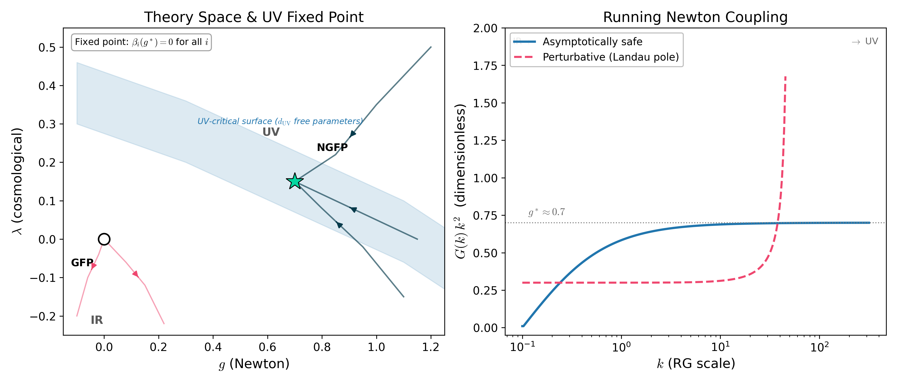

*Left: Theory space showing the Gaussian (GFP) and non-Gaussian (NGFP) fixed points, RG flow trajectories, and the UV-critical surface. Right: The dimensionless Newton coupling $g(k) = G(k)k^2$ — perturbative gravity diverges at a Landau pole, while asymptotic safety yields a finite UV limit at $g^*$.*

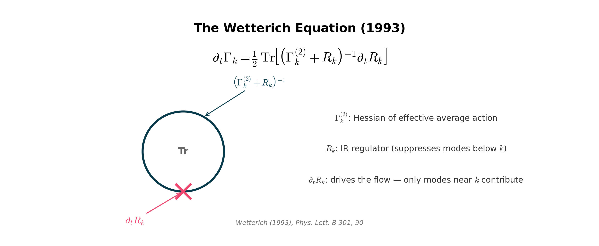

*The Wetterich equation: an exact one-loop functional RG equation. The circle represents the trace over the full regularised propagator $(\Gamma_{k}^{(2)} + R_k)^{-1}$, with a single regulator insertion $\partial_t R_k$ (cross). Only modes near the scale $k$ contribute to the flow.*

---

## RG Flow in the Einstein–Hilbert Truncation

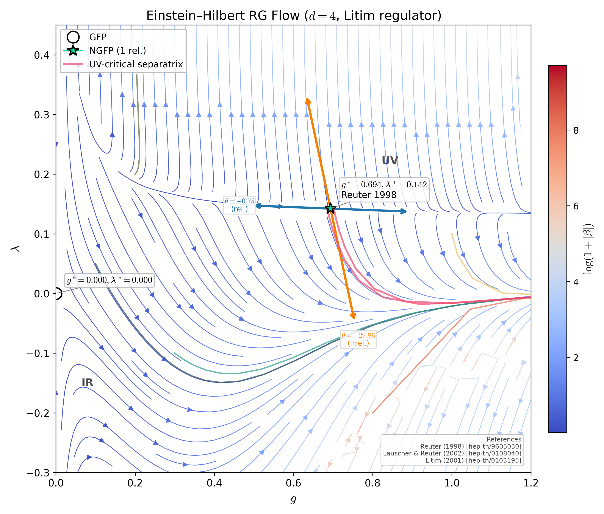

*RG flow in the $(g, \lambda)$ coupling plane ($d = 4$, Litim regulator). The non-Gaussian UV fixed point (NGFP, green star) at $g^* \approx 0.69$, $\lambda^* \approx 0.14$ has relevant (blue) and irrelevant (orange) eigendirections. The Gaussian fixed point (GFP, white circle) sits at the origin. Coloured curves are integrated trajectories from different initial conditions. The dashed line marks the $\lambda = \tfrac{1}{2}$ singularity boundary.*

---

## Capabilities


```mermaid
flowchart TD
    subgraph truncations["Gravitational Truncations"]
        eh["Einstein-Hilbert\n(G, Lambda)"]
        quad["Quadratic Gravity\n(G, Lambda, alpha, beta)\nR^2 + C^2 terms"]
        fol["Foliated ADM\n(G, Lambda, lambda_ADM)\nLorentzian signature"]
    end

    subgraph matter["Matter Coupling"]
        scalar["Scalar Fields\nMinimal, non-minimal xi R phi^2"]
        gauge["Gauge Fields\nU(1), SU(N)"]
        combined["Gravity-Matter\nFixed Points"]
    end

    subgraph methods["FRG Computation Engine"]
        reg["Regulators\nLitim, Exponential\nType-II, Type-III"]
        trace["Trace Evaluation\nHeat kernel (b0, b2, b4)\nSpectral sums on S^4, S^1 x S^3"]
        threshold["Threshold Functions\nPhi^p_n(w), Phi-tilde^p_n(w)\nClosed-form (Litim)"]
    end

    subgraph accel["Acceleration and Compute"]
        batch["Batch Evaluation\nNumPy broadcasting\nJAX vmap + jit (GPU)"]
        dist["Distributed Computing\nRay clusters\nDask, BOINC crowd"]
        cloud["Cloud Deployment\nDocker, Kubernetes\nRay autoscaling"]
    end

    subgraph ui["Interactive GUI and Visualization"]
        gui["Desktop GUI\nPySide6 cross-platform\n4 config panels"]
        viz3d["3D Visualization\nFlow trajectories\nPhase portraits, Stability"]
        viz2d["2D Visualization\nStreamplots\nRunning couplings, theta_i plots"]
    end

    truncations --> matter --> methods --> accel --> ui
```

### At a Glance

- **Three gravitational truncations**: Einstein-Hilbert, quadratic (R² + Weyl²), and Lorentzian foliated (ADM)
- **Matter sectors**: minimally and non-minimally coupled scalars, abelian and non-abelian gauge fields
- **Multiple FRG methods**: Litim/exponential regulators, heat kernel and spectral sum trace evaluation
- **Interactive GUI**: cross-platform PySide6 desktop application with 3D visualization
- **GPU acceleration**: JAX-based batch evaluation with `vmap` + `jit` for GPU/TPU
- **Distributed computing**: Ray clusters, Dask, and BOINC crowd computing with REST task server
- **Cloud deployment**: Docker, Ray autoscaling clusters, Kubernetes via KubeRay
- **Literature validation**: benchmarked against Reuter (1998), Codello et al. (2009), Manrique et al. (2011)

---

## Architecture

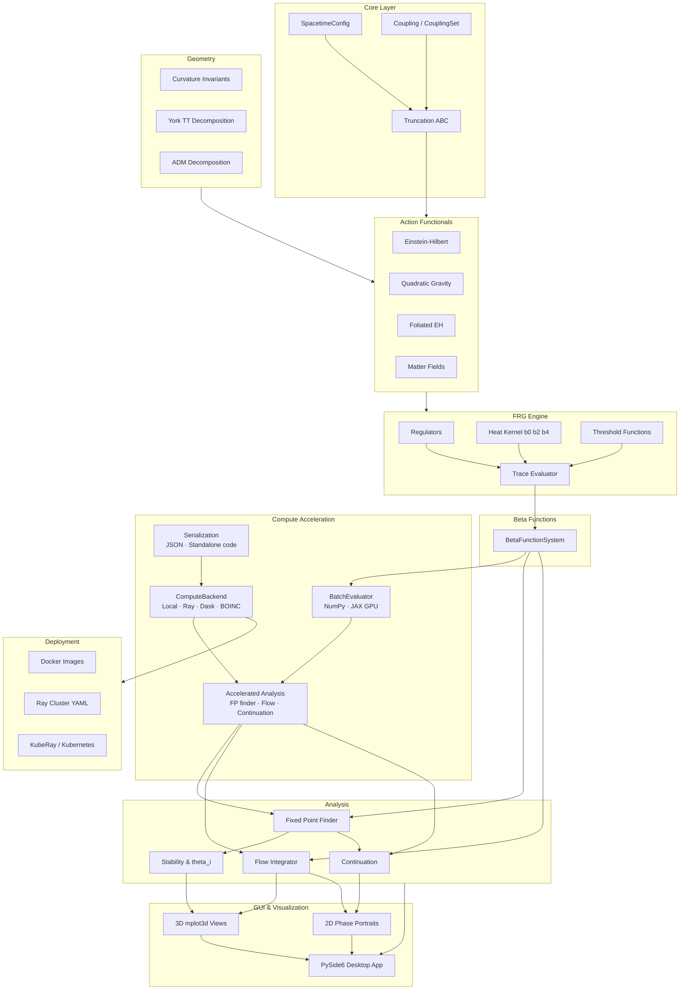
```mermaid
flowchart TD
    subgraph Core["Core Layer"]
        SP[SpacetimeConfig] --> TRUNC[Truncation ABC]
        COUP[Coupling / CouplingSet] --> TRUNC
    end

    subgraph Geometry["Geometry"]
        CURV[Curvature Invariants]
        YORK[York TT Decomposition]
        ADMG[ADM Decomposition]
    end

    subgraph Actions["Action Functionals"]
        EH[Einstein-Hilbert]
        QG[Quadratic Gravity]
        FOL[Foliated EH]
        MAT[Matter Fields]
    end

    subgraph FRG["FRG Engine"]
        REG[Regulators]
        HK[Heat Kernel b0 b2 b4]
        TRACE[Trace Evaluator]
        TH[Threshold Functions]
    end

    subgraph Beta["Beta Functions"]
        SYS[BetaFunctionSystem]
    end

    subgraph Compute["Compute Acceleration"]
        BATCH[BatchEvaluator\nNumPy · JAX GPU]
        BACKENDS[ComputeBackend\nLocal · Ray · Dask · BOINC]
        ACCEL[Accelerated Analysis\nFP finder · Flow · Continuation]
        SERIAL[Serialization\nJSON · Standalone code]
    end

    subgraph Analysis["Analysis"]
        FP[Fixed Point Finder]
        STAB[Stability & theta_i]
        FLOW[Flow Integrator]
        CONT[Continuation]
    end

    subgraph GUI["GUI & Visualization"]
        APP[PySide6 Desktop App]
        V3D[3D mplot3d Views]
        V2D[2D Phase Portraits]
    end

    subgraph Deploy["Deployment"]
        DOCKER[Docker Images]
        RAYCLUSTER[Ray Cluster YAML]
        K8S[KubeRay / Kubernetes]
    end

    TRUNC --> Actions
    Geometry --> Actions
    Actions --> FRG
    REG --> TRACE
    HK --> TRACE
    TH --> TRACE
    TRACE --> SYS
    SYS --> BATCH
    BATCH --> ACCEL
    BACKENDS --> ACCEL
    ACCEL --> FP
    ACCEL --> FLOW
    ACCEL --> CONT
    SYS --> FP
    SYS --> FLOW
    FP --> STAB
    FP --> CONT
    STAB --> V3D
    FLOW --> V3D
    FLOW --> V2D
    CONT --> V2D
    Analysis --> APP
    V3D --> APP
    V2D --> APP
    SERIAL --> BACKENDS
    BACKENDS --> Deploy
```

| Layer | Purpose | Key modules |
|-------|---------|-------------|
| **Core** | Spacetime config, couplings, truncation interface | `core/` |
| **Geometry** | Curvature invariants, York decomposition, ADM | `geometry/` |
| **Actions** | Gravitational + matter actions and Hessians | `actions/` |
| **FRG Engine** | Regulators, heat kernel, spectral sums, threshold functions | `frg/` |
| **Beta Functions** | Symbolic systems with lambdify numerical bridge | `beta/` |
| **Compute** | Batch evaluation, GPU, distributed backends, serialization | `compute/` |
| **Analysis** | Fixed points, stability, flow integration, continuation | `analysis/` |
| **GUI** | Interactive desktop application with 3D visualization | `gui/` |
| **Deploy** | Docker, Ray cluster, Kubernetes deployment | `deploy/` |

---

## Interactive GUI

Install with `pip install asymsafety[gui]` and launch with `asymsafety-gui`.

```
┌──────────────────────────────────────────────────────────────────┐
│ Menu: File │ View │ Help                                         │
├────────────────┬─────────────────────────────────────────────────┤
│ Config Panel   │  ┌─2D Phase─┬─3D Flow─┬─Couplings─┬─FP Info─┐ │
│                │  │           │          │           │         │ │
│ ┌System Setup┐ │  │  2D       │  3D      │  g(t),    │Stability│ │
│ │ Truncation │ │  │  stream   │  mplot3d │  λ(t)     │summary  │ │
│ │ Dimension  │ │  │  plot     │  with    │  vs RG    │+ θᵢ     │ │
│ │ Matter     │ │  │  with     │  rotate  │  time     │plots    │ │
│ └────────────┘ │  │  FPs      │  /zoom   │           │         │ │
│ ┌FP Finder  ┐ │  └───────────┴──────────┴───────────┴─────────┘ │
│ │ Grid scan  │ │                                                 │
│ │ Results    │ │                                                 │
│ └────────────┘ │                                                 │
│ ┌Flow Setup ┐ │                                                 │
│ │ Integrate  │ │                                                 │
│ └────────────┘ │                                                 │
│ ┌Continuation┐ │                                                 │
│ │ Param sweep│ │                                                 │
│ └────────────┘ │                                                 │
├────────────────┴─────────────────────────────────────────────────┤
│ Status: System: EH (g, λ) │ NGFP found at g*=0.69              │
└──────────────────────────────────────────────────────────────────┘
```

**Features:**
- **System Setup**: select truncation (EH / Quadratic / Foliated / EH+Matter), dimension, matter content
- **Fixed Point Finder**: initial guess or grid scan, results table with stability analysis
- **Flow Integration**: configurable initial conditions, "copy from FP" support, trajectory list
- **Parameter Continuation**: sweep matter content to track NGFP evolution
- **All computations run in background threads** (QThread) to keep the GUI responsive

---

## 3D Visualizations

Three interactive 3D visualization functions using `mpl_toolkits.mplot3d`, with mouse rotation and zoom:

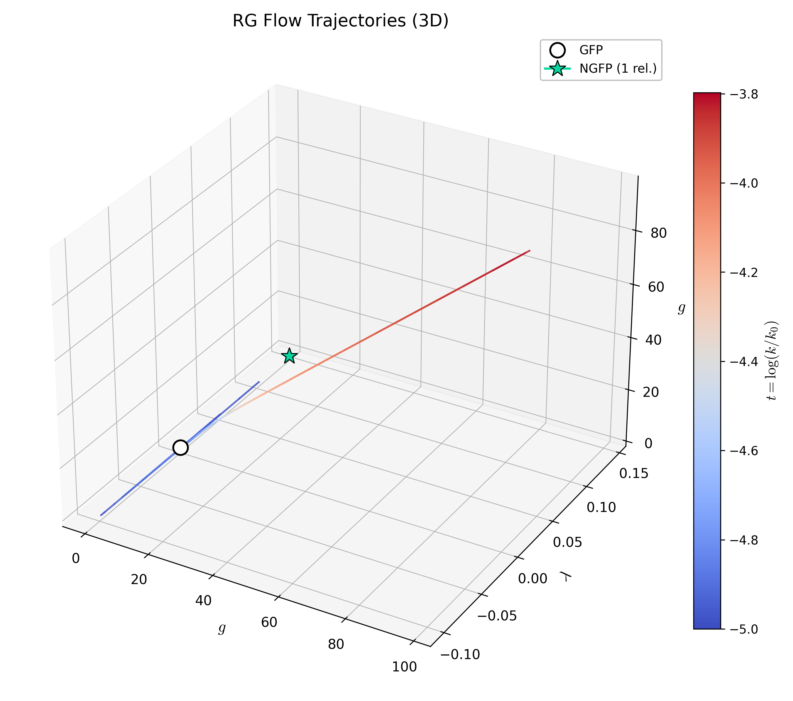

*3D flow trajectories coloured by RG time (blue = IR, red = UV), with fixed points marked.*

### RG Flow Trajectories in 3D Coupling Space

```python
from asymsafety.beta.quadratic import build_quadratic_beta_system
from asymsafety.analysis.fixed_points import FixedPointFinder
from asymsafety.analysis.stability import analyze_stability
from asymsafety.analysis.flow import FlowIntegrator
from asymsafety.gui.visualization_3d import flow_trajectories_3d

# Build 4-coupling system and find fixed points
system = build_quadratic_beta_system(d=4)
finder = FixedPointFinder(system)
fps = finder.find_all_fixed_points(
    bounds={"g": (0, 2), "lambda": (-0.5, 0.5), "alpha": (-1, 1), "beta": (-1, 1)}
)

# Integrate trajectories from multiple initial conditions
integrator = FlowIntegrator(system)
trajectories = [
    integrator.integrate({"g": 0.3, "lambda": 0.05, "alpha": 0.1, "beta": 0.1}),
    integrator.integrate({"g": 1.0, "lambda": 0.2, "alpha": -0.5, "beta": 0.3}),
]

# 3D plot: trajectories colored by RG time (blue=IR → red=UV)
# Fixed points as markers, eigenvector arrows showing stability
fig = flow_trajectories_3d(
    trajectories, "g", "lambda", "alpha",
    fixed_points=fps, show_eigenvectors=True, eigenvector_scale=0.3,
)
fig.savefig("flow_3d.png", dpi=150)
```

### 3D Phase Portrait (Vector Field)

```python
from asymsafety.gui.visualization_3d import phase_portrait_3d

# 3D quiver plot of the beta function vector field
fig = phase_portrait_3d(
    system, "g", "lambda", "alpha",
    x_range=(0, 1.5), y_range=(-0.3, 0.4), z_range=(-0.5, 0.5),
    n_grid=8, fixed_points=fps,
)
```

### Fixed Point Stability in 3D

```python
from asymsafety.gui.visualization_3d import fixed_point_stability_3d

# Zoomed view: eigenvector arrows at a single FP
# Blue = relevant (UV-attractive), orange = irrelevant
# Arrow width proportional to |Re(θᵢ)|
# Dashed arcs indicate spiral flow for complex eigenvalues
sa = analyze_stability(system, fps[1])
fig = fixed_point_stability_3d(
    fps[1], sa, "g", "lambda", "alpha", scale=0.5,
)
```

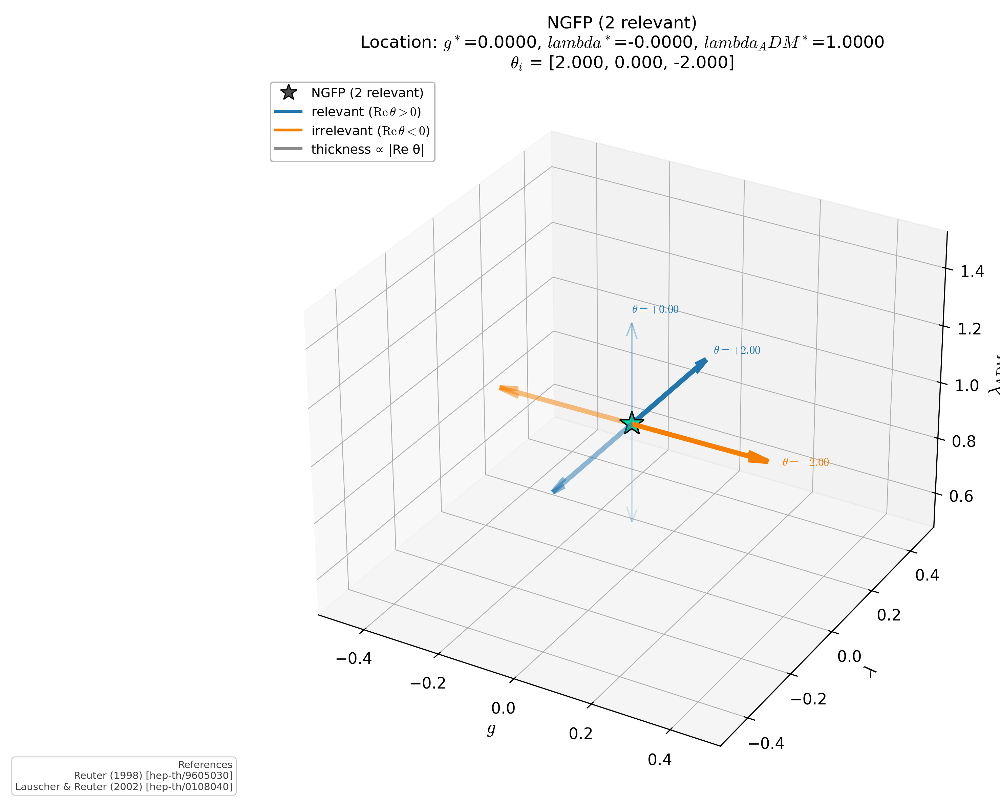

*Eigenvector view of the foliated EH NGFP — blue = relevant, orange = irrelevant, dashed arcs flag complex-conjugate spiral flow.*


*Monte-Carlo basin: blue trajectories stayed bounded, orange escaped — projected onto the $(g, \lambda, t)$ axes.*

---

## GPU & Compute Acceleration

### Batch Beta Function Evaluation

Replace per-point loops with vectorized array evaluation:

```python
from asymsafety.beta.einstein_hilbert import build_eh_beta_system
import numpy as np

system = build_eh_beta_system(d=4)

# NumPy batch evaluator (always available)
evaluator = system.batch_evaluator("numpy")
points = np.random.rand(10_000, 2)  # 10K points in (g, λ) space
betas = evaluator.evaluate_batch(points)   # (10000, 2) array — one call
norms = evaluator.evaluate_norms(points)   # (10000,) — |β(x)| at each point
```

### JAX GPU Acceleration

```python
# GPU-accelerated via JAX vmap + jit (requires: pip install asymsafety[gpu])
evaluator = system.batch_evaluator("jax")
betas = evaluator.evaluate_batch(points)  # Runs on GPU if available
```

### Accelerated Fixed Point Search

Two-phase approach: batch pre-filter (GPU) → parallel root-finding (multicore/distributed):

```python
from asymsafety.compute.accelerated.fixed_points import AcceleratedFixedPointFinder
from asymsafety.compute import get_backend

backend = get_backend("auto")  # Auto-selects best available
finder = AcceleratedFixedPointFinder(system, backend=backend)

fps = finder.find_all_fixed_points(
    bounds={"g": (0, 3), "lambda": (-1, 0.5)},
    n_grid=20, n_random=100,
    prefilter_threshold=1.0,  # Batch-filters 90%+ of grid points
)
```

### Parallel Flow Integration

```python
from asymsafety.compute.accelerated.flow import AcceleratedFlowIntegrator

integrator = AcceleratedFlowIntegrator(system, backend=backend)

# Integrate 25 trajectories from a 5×5 grid — all in parallel
trajectories = integrator.integrate_grid(
    coupling_ranges={"g": (0.1, 1.5), "lambda": (0.0, 0.3)},
    n_per_dim=5, t_span=(-10, 10),
)
```

---

## Distributed & Cloud Computing

### Acceleration Pipeline

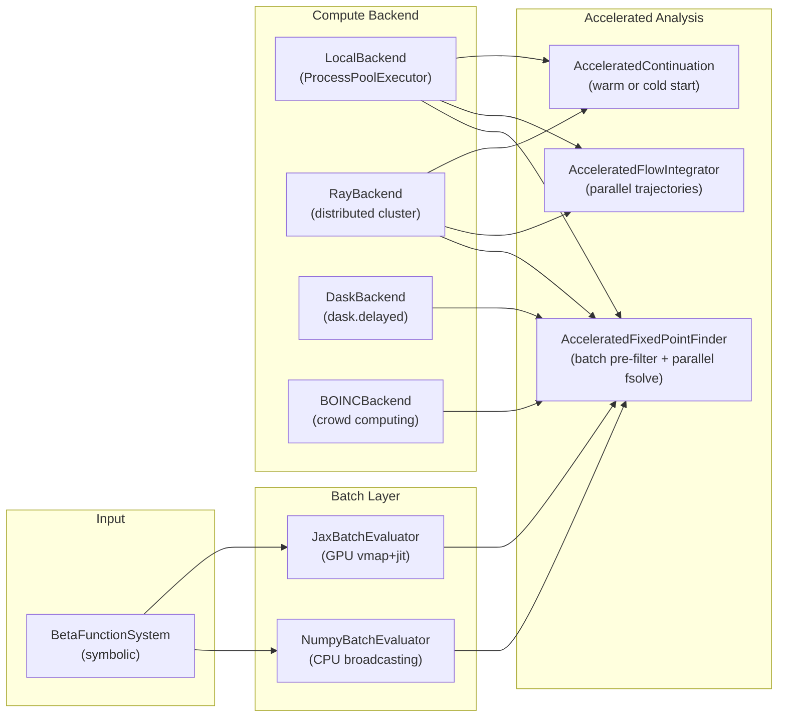
```mermaid
flowchart LR
    subgraph Input
        SYS["BetaFunctionSystem\n(symbolic)"]
    end

    subgraph Batch["Batch Layer"]
        NP["NumpyBatchEvaluator\n(CPU broadcasting)"]
        JAX["JaxBatchEvaluator\n(GPU vmap+jit)"]
    end

    subgraph Backend["Compute Backend"]
        LOCAL["LocalBackend\n(ProcessPoolExecutor)"]
        RAY["RayBackend\n(distributed cluster)"]
        DASK["DaskBackend\n(dask.delayed)"]
        BOINC["BOINCBackend\n(crowd computing)"]
    end

    subgraph Accelerated["Accelerated Analysis"]
        AFP["AcceleratedFixedPointFinder\n(batch pre-filter + parallel fsolve)"]
        AFLW["AcceleratedFlowIntegrator\n(parallel trajectories)"]
        ACNT["AcceleratedContinuation\n(warm or cold start)"]
    end

    SYS --> NP
    SYS --> JAX
    NP --> AFP
    JAX --> AFP
    LOCAL --> AFP
    RAY --> AFP
    DASK --> AFP
    BOINC --> AFP
    LOCAL --> AFLW
    RAY --> AFLW
    LOCAL --> ACNT
    RAY --> ACNT
```

### Ray Distributed Computing

```python
# Distribute across a Ray cluster (requires: pip install asymsafety[distributed])
from asymsafety.compute.backends.ray_backend import RayBackend

backend = RayBackend(address="ray://cluster-head:10001")  # Connect to cluster
finder = AcceleratedFixedPointFinder(system, backend=backend)
fps = finder.find_all_fixed_points(n_grid=50, n_random=500)  # Distributed search
```

### Dask Backend

```python
from asymsafety.compute.backends.dask_backend import DaskBackend

backend = DaskBackend(scheduler="distributed", n_workers=8)
integrator = AcceleratedFlowIntegrator(system, backend=backend)
trajectories = integrator.integrate_multiple(initial_conditions_list)
```

### BOINC / Crowd Computing

```bash
# Start the task server
python -m asymsafety.compute.distributed.task_server --port 8765
```

```python
from asymsafety.compute.backends.boinc_backend import BOINCBackend

backend = BOINCBackend(server_url="http://taskserver:8765")
finder = AcceleratedFixedPointFinder(system, backend=backend)
fps = finder.find_all_fixed_points()  # Work distributed to volunteer clients
```

### Serialization for Remote Workers

```python
from asymsafety.compute.distributed.serialization import (
    serialize_to_json, deserialize_from_json, generate_standalone_code,
)

# Serialize system for transport (JSON with SymPy srepr strings)
json_str = serialize_to_json(system)
# ... send to remote worker ...
restored_system = deserialize_from_json(json_str)

# Generate standalone code (no SymPy required on worker)
code = generate_standalone_code(system)
# Produces: def beta_g(g, lambda_): ..., def beta_lambda_(g, lambda_): ...
```

---

## Cloud Deployment

### Docker

```python
from asymsafety.deploy.docker import generate_dockerfile, generate_compose

# CPU image
print(generate_dockerfile(gpu=False, ray=True))

# GPU image (NVIDIA CUDA + JAX)
print(generate_dockerfile(gpu=True, ray=True))

# docker-compose for local multi-container testing
print(generate_compose(n_workers=4, gpu=False))
```

### Ray Cluster (AWS/GCP/Azure)

```python
from asymsafety.deploy.ray_cluster import generate_ray_cluster_yaml

yaml = generate_ray_cluster_yaml(
    provider="aws",
    head_instance="m5.xlarge",
    gpu_worker_instance="g4dn.xlarge",
    max_workers=10,
    region="us-east-1",
)
# Save to cluster.yaml, then: ray up cluster.yaml
```

### Kubernetes (KubeRay)

```python
from asymsafety.deploy.ray_cluster import generate_kuberay_spec

spec = generate_kuberay_spec(replicas=4, gpu_per_worker=1, image="asymsafety:latest")
# Apply with: kubectl apply -f spec.yaml
```

---

## Fixed Point Stability & Critical Exponents

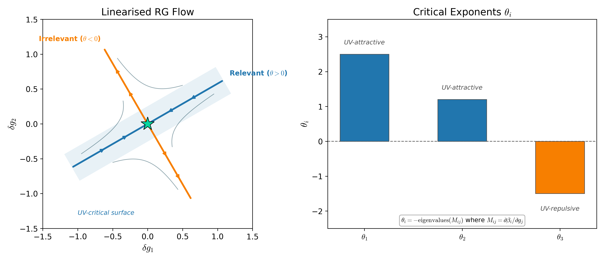

*Left: Linearised RG flow near a non-Gaussian fixed point. Blue eigenvectors correspond to relevant directions ($\theta > 0$, UV-attractive), orange to irrelevant ($\theta < 0$, UV-repulsive). The shaded region is the UV-critical surface. Right: Critical exponents $\theta_i = -\text{eigenvalues}(M_{ij})$ with colour coding for relevance.*

---

## Running Couplings

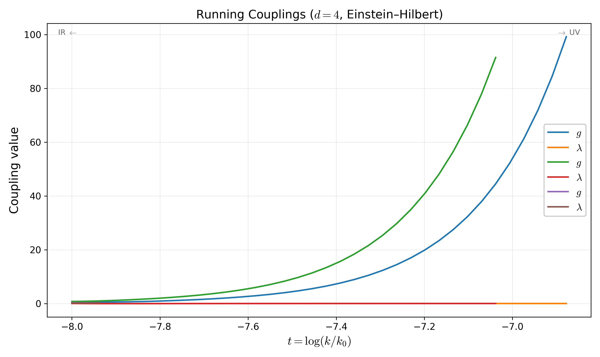

*Evolution of the dimensionless Newton coupling $g$ and cosmological constant $\lambda$ as a function of RG time $t = \log(k/k_0)$ for several initial conditions in the Einstein–Hilbert truncation.*

---

## Supported Truncations

### Einstein-Hilbert

$$\Gamma_k = \frac{1}{16\pi G}\int d^4x\,\sqrt{g}\,(R - 2\Lambda)$$

Two dimensionless couplings: $g = Gk^2$ (Newton) and $\lambda = \Lambda/k^2$ (cosmological constant). The Hessian is evaluated on a round $S^4$ background via the York transverse-traceless decomposition into spin-2 (TT), spin-1 (vector), and spin-0 (scalar/conformal) sectors.

### Quadratic Gravity

$$\Gamma_k = \int d^4x\,\sqrt{g}\left[\frac{R - 2\Lambda}{16\pi G} + \alpha\, R^2 + \beta\, C_{\mu\nu\rho\sigma}C^{\mu\nu\rho\sigma}\right]$$

Four couplings $(g, \lambda, \alpha, \beta)$. The $R^2$ and Weyl-squared ($C^2$) terms generate **fourth-order propagators** decomposed via partial fractions. The Weyl-squared coupling $\beta$ is **asymptotically free**.

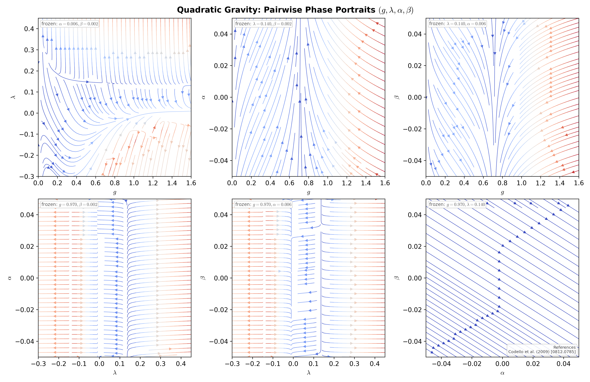

*Six pairwise streamplots of the four-coupling quadratic-gravity flow $(g, \lambda, \alpha, \beta)$.*

### Lorentzian Foliated (ADM)

$$\Gamma_k = \frac{1}{16\pi G}\int dt\,d^3x\,N\sqrt{\sigma}\left(K_{ij}K^{ij} - \lambda_{\text{ADM}}\,K^2 + R^{(3)} - 2\Lambda\right)$$

Three couplings $(g, \lambda, \lambda_{\text{ADM}})$ on background $S^1 \times S^3$. At the NGFP, $\lambda_{\text{ADM}} \to 1$, restoring full diffeomorphism invariance. A **foliated quadratic extension** adds up to 7 independent FDiff curvature-squared invariants.

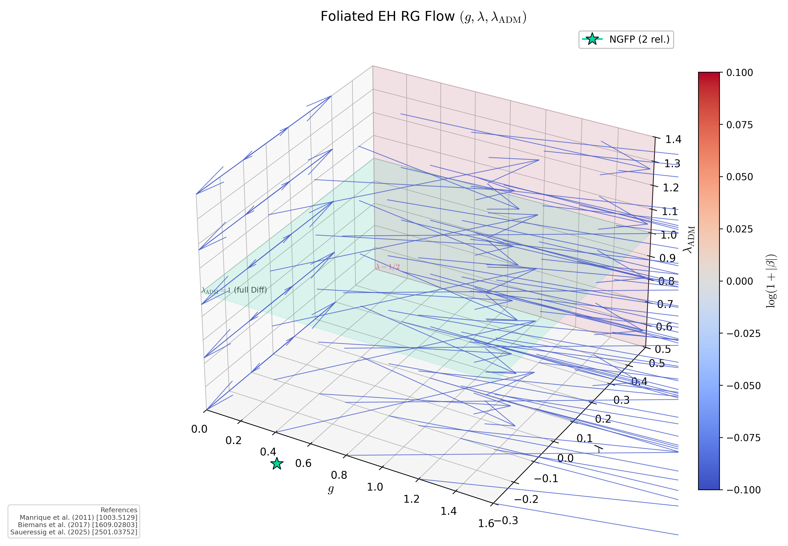

*3D phase portrait of the foliated EH truncation, with the $\lambda_{\text{ADM}} = 1$ full-diffeomorphism plane highlighted.*

### Matter Coupling

- **Scalar fields**: minimally coupled ($\xi = 0$) or non-minimally coupled ($\xi R\varphi^2$)
- **Gauge fields**: $U(1)$ and $SU(N)$ with transverse + ghost mode counting
- **Combined analysis**: matter contributions parameterised by $(N_s, N_D, N_v)$; parameter continuation tracks the NGFP as matter content varies

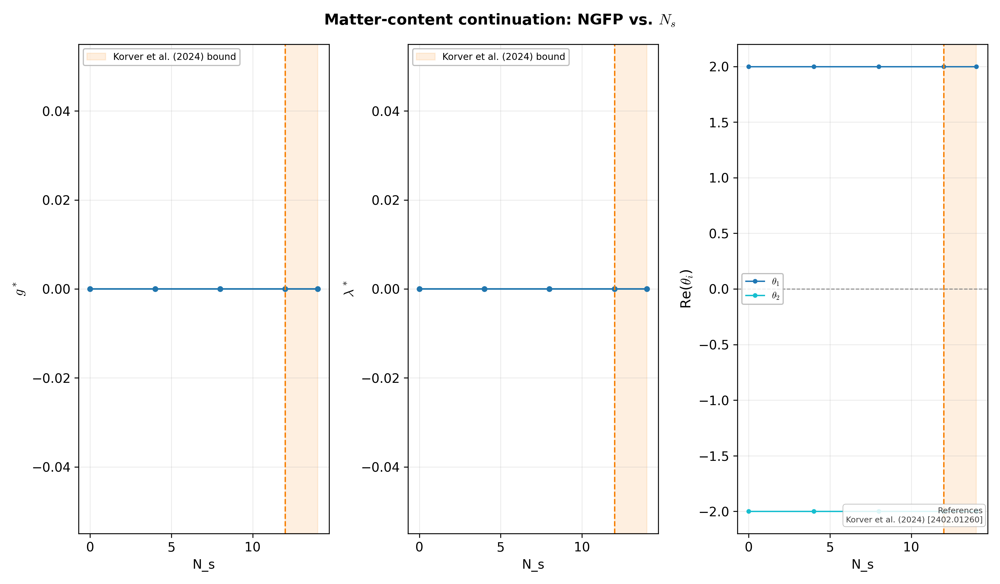

*Continuation of the NGFP coordinates and critical exponents under a sweep of $N_s$, with the Korver–Saueressig–Wang (2024) foliated bound shaded.*

---

## FRG Methods

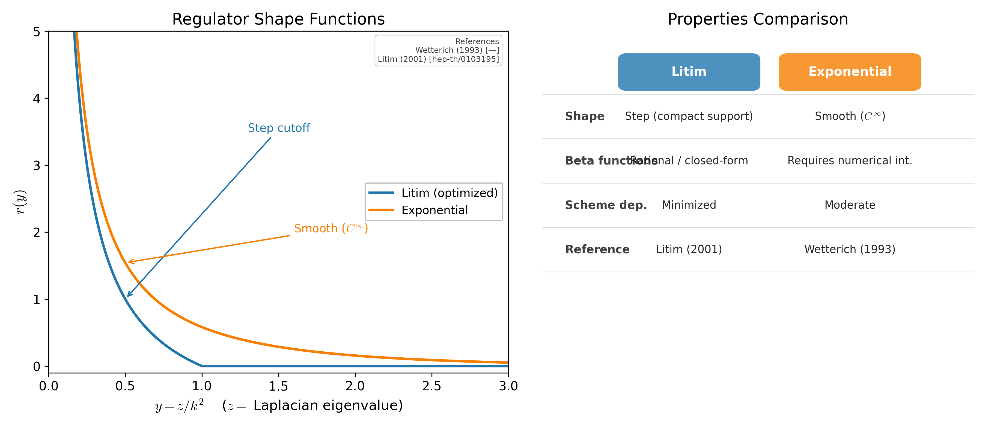

*Comparison of the Litim (optimised, step-function) and Exponential (smooth) IR regulators. The Litim regulator yields closed-form beta functions and minimises scheme dependence; the Exponential regulator is $C^\infty$ but requires numerical integration.*

| Regulator | $R_k(z)$ | Properties |
|-----------|----------|------------|
| **Litim** (optimised) | $(k^2 - z)\,\theta(k^2 - z)$ | Rational beta functions; minimises scheme dependence |
| **Exponential** | $z/(e^{z/k^2} - 1)$ | Smooth ($C^\infty$); requires numerical integration |
| **Type-II** | Acts on $\Delta$ in the full operator | For higher-derivative theories |
| **Type-III** | Separate regulator per propagator pole | After partial-fraction decomposition |

- **Heat kernel**: Seeley-DeWitt $b_0, b_2, b_4$ with Q-functionals
- **Spectral sums**: eigenvalue spectra on $S^4$ and $S^1 \times S^3$ (vectorized: 100K iterations in one NumPy call)
- **Threshold functions**: $\Phi^{p}_{n}(w) = 1/[\Gamma(n+1)(1+w)^{p}]$ (Litim closed form)
- **Anomalous dimension**: self-consistent $\eta_N = gA(\lambda) / [1 - gB(\lambda)]$

---

## Quick Start

```bash
pip install -e "."                    # Core library
pip install -e ".[gui]"               # + Desktop GUI
pip install -e ".[gpu]"               # + JAX GPU acceleration
pip install -e ".[distributed]"       # + Ray distributed computing
pip install -e ".[gui,gpu,distributed]"  # Everything
```

### Find the Reuter Fixed Point

```python
from asymsafety.beta.einstein_hilbert import build_eh_beta_system
from asymsafety.analysis.fixed_points import FixedPointFinder
from asymsafety.analysis.stability import analyze_stability

system = build_eh_beta_system(d=4)
finder = FixedPointFinder(system)
fp = finder.find_fixed_point({"g": 0.7, "lambda": 0.14})

sa = analyze_stability(system, fp)
print(f"g* = {fp.location['g']:.4f}, lambda* = {fp.location['lambda']:.4f}")
print(f"Critical exponents: {sa.critical_exponents}")
print(f"Relevant directions: {fp.relevant_directions}")
```

### GPU-Accelerated Grid Search

```python
from asymsafety.compute.accelerated.fixed_points import AcceleratedFixedPointFinder
from asymsafety.compute import get_backend

finder = AcceleratedFixedPointFinder(system, backend=get_backend("auto"))
fps = finder.find_all_fixed_points(n_grid=20, prefilter_threshold=0.5)
```

### Launch the GUI

```bash
asymsafety-gui
```

---

## Physical Computational Analogues

The toolkit provides three novel physical mappings — hydraulic networks, quantum circuits, and integral/linear transforms — connected via a commutative bridge that verifies all domains produce consistent critical exponents.

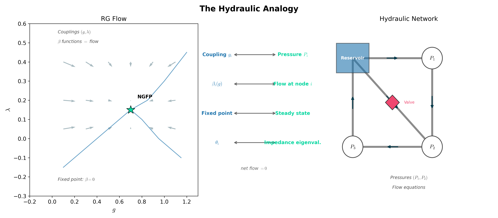

*The hydraulic analogy: RG couplings map to pressures, beta functions to flow equations, fixed points to steady states, and critical exponents to impedance eigenvalues. Regulators map to valve types (Litim → on/off, Exponential → proportional).*

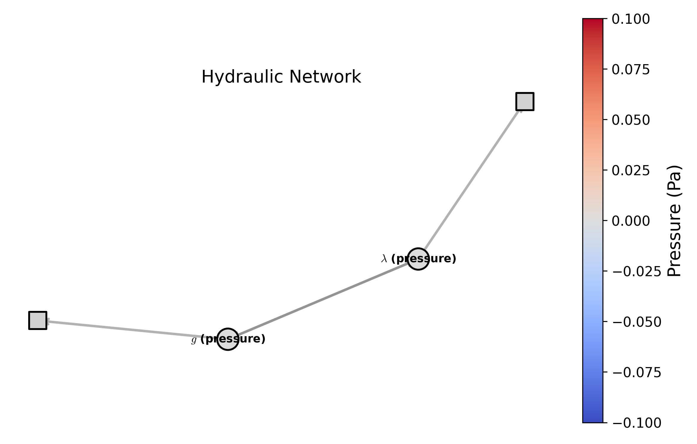

*Hydraulic network generated from the Einstein–Hilbert beta function system, with nodes coloured by pressure.*

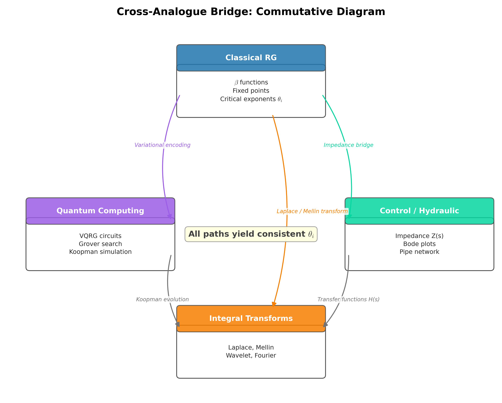

*Commutative diagram showing how different mathematical representations (classical RG, control theory / hydraulic, integral transforms, quantum computing) are connected. All paths through the diagram yield consistent critical exponents $\theta_i$.*

### Transform domain

| | | |
|:---:|:---:|:---:|
| 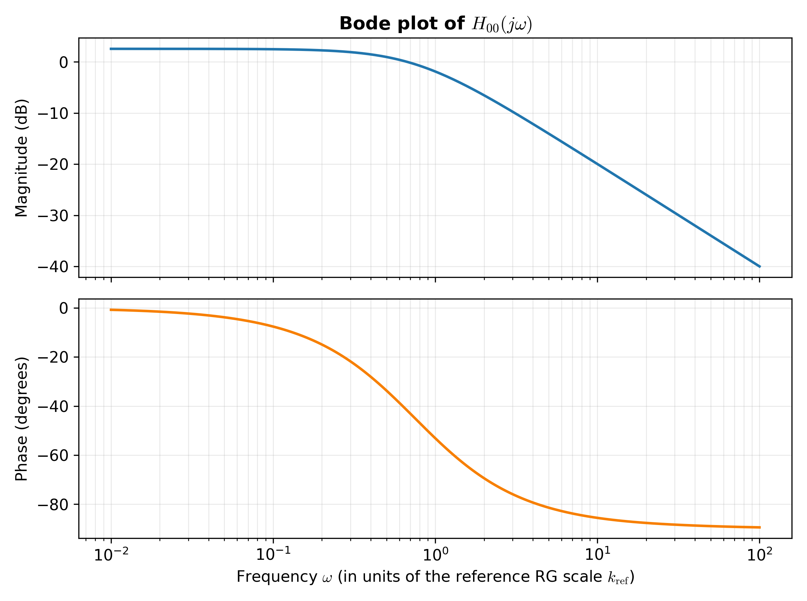 | 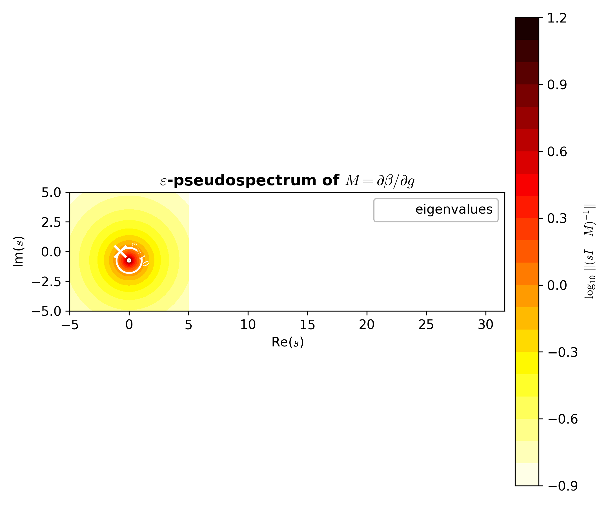 | 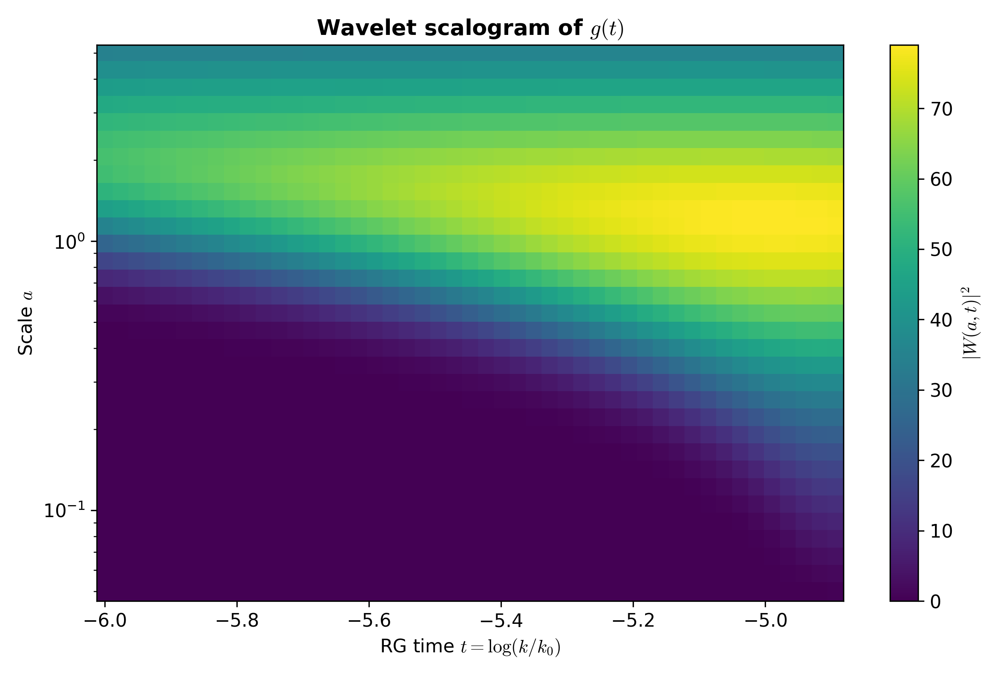 |
| Bode plot of the EH stability matrix | $\varepsilon$-pseudospectrum (robustness of $\theta_i$) | Wavelet scalogram of $g(t)$ |

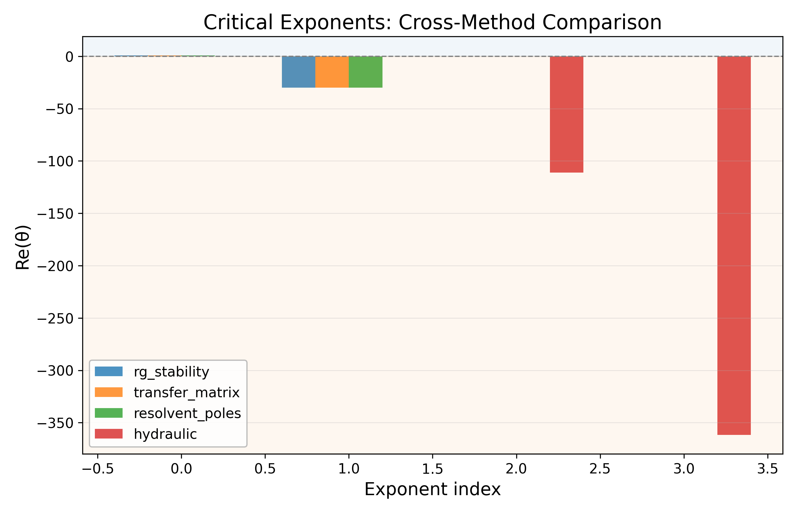

*Side-by-side critical exponents from RG stability, transfer-matrix exponentiation, resolvent poles, and the hydraulic-impedance steady state — the cross-analogue bridge requires within-group bars to align.*

### Quantum domain

The toolkit ships canonical plotters for every quantum sub-domain (Koopman / Grover / VQRG / thermal). Examples below use the Einstein-Hilbert truncation:

| | | |
|:---:|:---:|:---:|
| 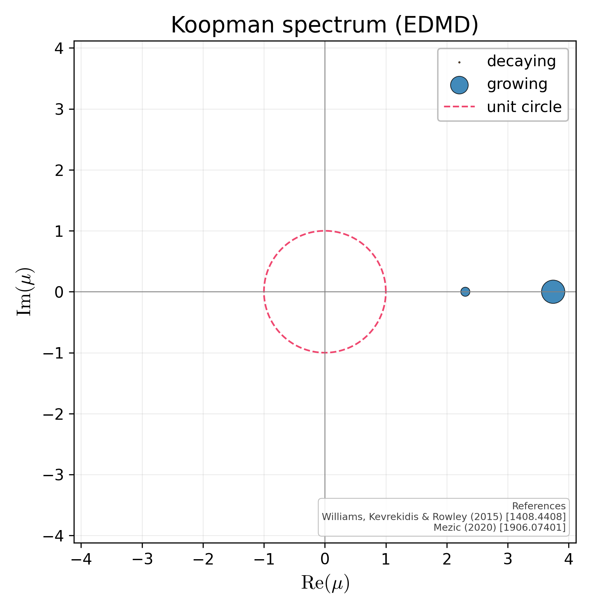 | 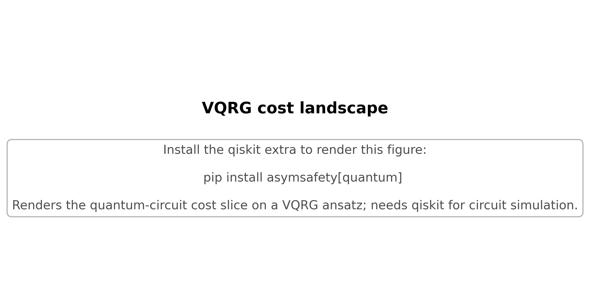 | 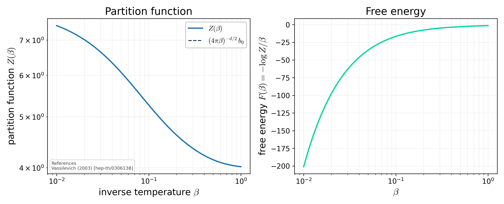 |
| Koopman eigenvalues from EDMD | VQRG cost landscape (2-parameter slice) | Heat-kernel partition function $Z(\beta)$ |

```python
# Three-line VQRG-cost-landscape recipe (qiskit needed for the circuit step)
from asymsafety.quantum.vqrg.cost import VQRGCostFunction
from asymsafety.quantum.visualization import plot_vqrg_cost_landscape
fig = plot_vqrg_cost_landscape(cost, base_params, dims=(0, 1), n_grid=24)
```

See [`docs/visualization-guide.md`](docs/visualization-guide.md#6-quantum) for the full quantum gallery (Koopman modes, Grover success-probability and measurement distribution, quantum Fisher information, Gibbs purity, Seeley–DeWitt extraction).

### Cosmology

RG-improved Schwarzschild geometry and FLRW cosmology with the running couplings substituted for the classical $G_N$ and $\Lambda$:

| | | |
|:---:|:---:|:---:|
| 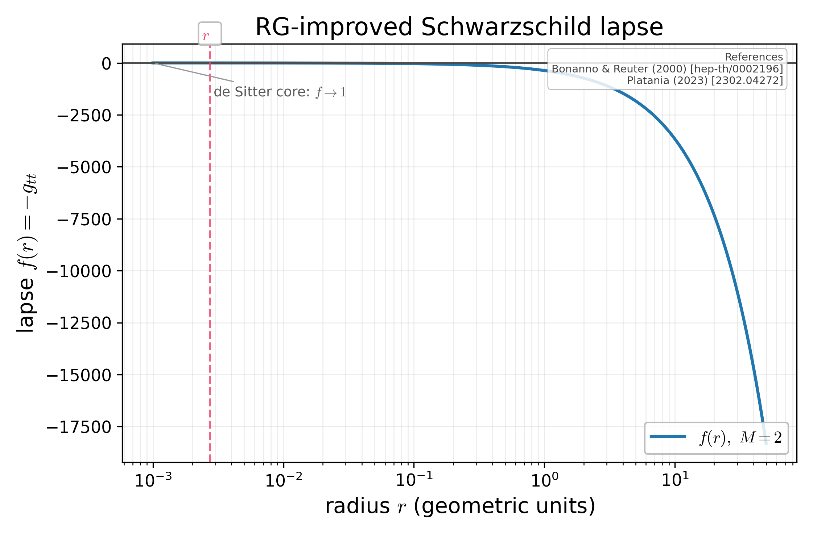 | 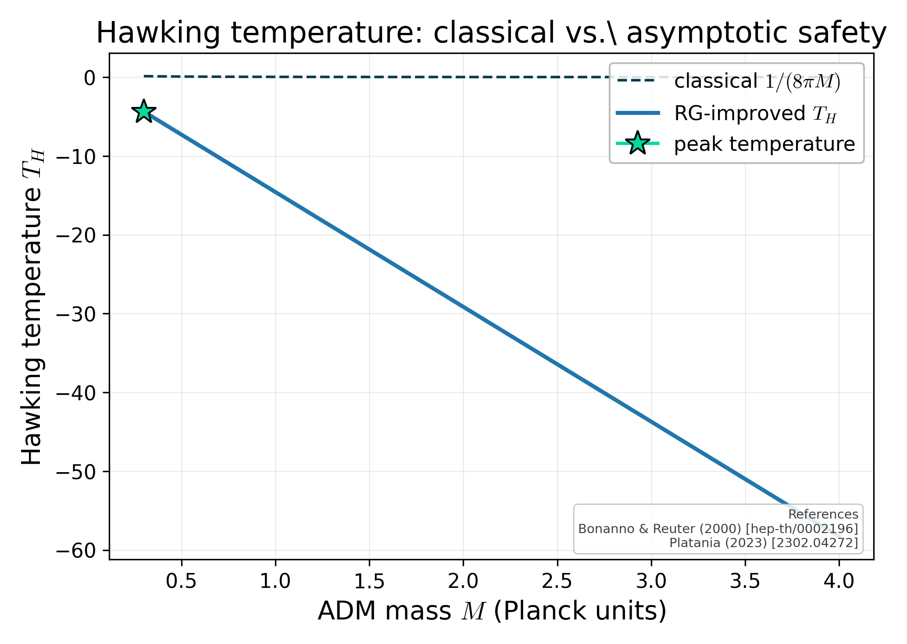 | 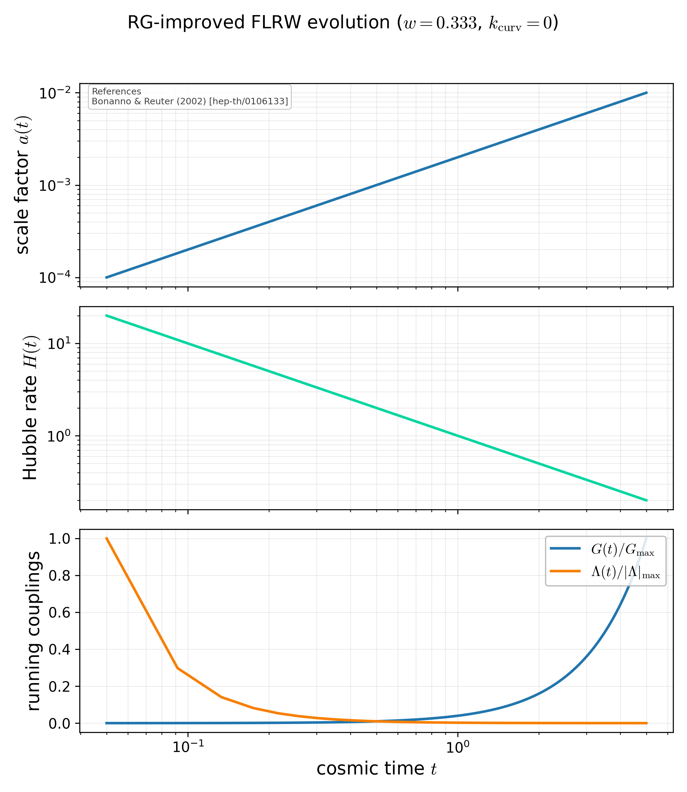 |
| RG-improved Schwarzschild lapse with $r_\pm$ | Hawking $T_H(M)$ — peak then zero at $M_{\text{crit}}$ | $a(t)$, $H(t)$, and running couplings |

```python
from asymsafety.cosmology.rg_improved_bh import RGImprovedSchwarzschild
from asymsafety.cosmology.visualization import plot_lapse_with_horizons
bh = RGImprovedSchwarzschild(trajectory=eh_trajectory, M=2.0)
fig = plot_lapse_with_horizons(bh)
```

---

## Project Structure

```
src/asymsafety/
├── core/               # Spacetime config, couplings, truncation interface
├── geometry/           # Curvature invariants, York decomposition, ADM variables
├── actions/            # EH, quadratic, foliated, matter, ghost, gauge fixing
├── frg/                # Regulators, heat kernel, spectral sums, threshold functions
├── beta/               # Beta function systems (EH, quadratic, foliated, matter)
├── analysis/           # Fixed points, stability, flow integration, continuation
├── visualization/      # 2D phase portraits, critical exponent plots
├── validation/         # Literature benchmark values
├── gui/                # PySide6 desktop app: panels, views, 3D visualization
│   ├── panels/         #   System, FP finder, flow, continuation config
│   ├── views/          #   2D phase, 3D flow, running couplings, FP analysis
│   └── visualization_3d.py  # 3D mplot3d plotting functions
├── compute/            # GPU & distributed acceleration
│   ├── batch/          #   NumPy + JAX batch evaluators, vectorized spectral sums
│   ├── backends/       #   Local, JAX, Ray, Dask, BOINC compute backends
│   ├── accelerated/    #   Accelerated FP finder, flow integrator, continuation
│   └── distributed/    #   Serialization, REST task server, work units
└── deploy/             # Docker, Ray cluster YAML, KubeRay specs
tests/                  # 78 tests across 11 files
```

**88 source files | ~9,260 lines | 78 tests passing**

---

## Validation Benchmarks

| Truncation | Reference | Key Result | Status |
|------------|-----------|------------|--------|
| Einstein-Hilbert | Reuter (1998) | NGFP with $\eta_{N}^{*} = -2$; complex critical exponents | Verified |
| Quadratic gravity | Codello et al. (2009) | Asymptotic freedom of $C^2$ coupling | Implemented |
| Foliated EH | Manrique et al. (2011) | $\lambda_{\text{ADM}}^{*} = 1$ (full-Diff restoration) | Implemented |
| Lorentzian foliated | Biemans et al. (2017) | Lorentzian signature effects on NGFP | Implemented |

---

## Dependencies

| Package | Version | Purpose | Install |
|---------|---------|---------|---------|
| SymPy | ≥ 1.13 | Symbolic algebra | Core |
| NumPy | ≥ 1.26 | Numerical arrays | Core |
| SciPy | ≥ 1.12 | Root finding, ODE integration | Core |
| Matplotlib | ≥ 3.8 | 2D/3D plotting | Core |
| PySide6 | ≥ 6.6 | Desktop GUI | `pip install .[gui]` |
| JAX | ≥ 0.4 | GPU acceleration | `pip install .[gpu]` |
| Ray | ≥ 2.9 | Distributed computing | `pip install .[distributed]` |
| Dask | ≥ 2024.1 | Distributed (alternative) | `pip install .[dask]` |

---

## References

1. S. Weinberg, *Ultraviolet divergences in quantum theories of gravitation*, in "General Relativity: An Einstein Centenary Survey" (1979)
2. M. Reuter, *Nonperturbative evolution equation for quantum gravity*, Phys. Rev. D **57**, 971 (1998) [[hep-th/9605030](https://arxiv.org/abs/hep-th/9605030)]
3. C. Wetterich, *Exact evolution equation for the effective potential*, Phys. Lett. B **301**, 90 (1993)
4. O. Lauscher & M. Reuter, *Ultraviolet fixed point and generalized flow equation of quantum gravity*, Phys. Rev. D **65**, 025013 (2002) [[hep-th/0108040](https://arxiv.org/abs/hep-th/0108040)]
5. A. Codello, R. Percacci & C. Rahmede, *Investigating the ultraviolet properties of gravity with a Wilsonian renormalization group equation*, Ann. Phys. **324**, 414 (2009) [[0812.0785](https://arxiv.org/abs/0812.0785)]
6. E. Manrique, S. Rechenberger & F. Saueressig, *Asymptotically safe Lorentzian gravity*, Phys. Rev. Lett. **106**, 251302 (2011) [[1003.5129](https://arxiv.org/abs/1003.5129)]
7. J. Biemans, A. Platania & F. Saueressig, *Quantum gravity on foliated spacetimes*, JHEP **05**, 093 (2017) [[1609.02803](https://arxiv.org/abs/1609.02803)]
8. A. Dona, A. Eichhorn & R. Percacci, *Matter matters in asymptotically safe quantum gravity*, Phys. Rev. D **89**, 084035 (2014) [[1311.2898](https://arxiv.org/abs/1311.2898)]
9. D.F. Litim, *Optimized renormalization group flows*, Phys. Rev. D **64**, 105007 (2001) [[hep-th/0103195](https://arxiv.org/abs/hep-th/0103195)]
10. D.V. Vassilevich, *Heat kernel expansion: user's manual*, Phys. Rept. **388**, 279 (2003) [[hep-th/0306138](https://arxiv.org/abs/hep-th/0306138)]
11. A. Bonanno, A. Eichhorn, H. Gies, J.M. Pawlowski, R. Percacci, M. Reuter, F. Saueressig & G.P. Vacca, *Critical reflections on asymptotically safe gravity*, Front. Phys. **8**, 269 (2020) [[2004.06810](https://arxiv.org/abs/2004.06810)]
12. F. Saueressig, *The Functional Renormalization Group in Quantum Gravity*, in Handbook of Quantum Gravity, Springer (2023) [[2302.14152](https://arxiv.org/abs/2302.14152)]
13. G.B. D'Angelo, N. Drago, N. Pinamonti & K. Rejzner, *Asymptotic safety in Lorentzian quantum gravity*, Phys. Rev. D **109**, 066012 (2024) [[2310.20603](https://arxiv.org/abs/2310.20603)]
14. G. Korver, F. Saueressig & J. Wang, *Global Flows of Foliated Gravity-Matter Systems*, Phys. Lett. B **855**, 138789 (2024) [[2402.01260](https://arxiv.org/abs/2402.01260)]
15. F. Saueressig et al., *Foliated Asymptotically Safe Gravity: Lorentzian Signature Fluctuations from the Wick Rotation*, Phys. Rev. D **111**, 106007 (2025) [[2501.03752](https://arxiv.org/abs/2501.03752)]
16. T. Draper, B. Knorr, C. Ripken & F. Saueressig, *$e^+e^- \to \mu^+\mu^-$ in the Asymptotically Safe Standard Model*, Phys. Rev. D **111**, 106005 (2025) [[2412.13800](https://arxiv.org/abs/2412.13800)]
17. A. Platania, *Black Holes in Asymptotically Safe Gravity*, in Handbook of Quantum Gravity, Springer (2023) [[2302.04272](https://arxiv.org/abs/2302.04272)]

For a comprehensive review of recent literature organized by topic, see [docs/LITERATURE.md](docs/LITERATURE.md).

---

## License

MIT License. See [LICENSE](LICENSE) for details.
