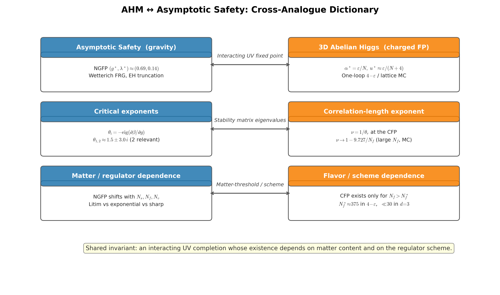

# AHM ↔ asymptotic safety: cross-analogue dictionary

Two-column commutative diagram mapping the 3D Abelian-Higgs charged fixed point onto the asymptotic-safety NGFP. Three rows of correspondences (interacting UV fixed point; stability-matrix eigenvalues; matter/regulator dependence) are joined by double-headed arrows. The shared invariant in the bottom strip is: an interacting UV completion whose existence depends on matter content and on the regulator scheme.

## References

- Bonati, Pelissetto & Vicari (2025), Phys. Rep. [arXiv:2410.05823].
- Reuter (1998), Phys. Rev. D 57, 971 [hep-th/9605030].

## See also

- [`docs/cross-analogue-gauge-higgs.md`](../cross-analogue-gauge-higgs.md)
- `asymsafety.transforms.bridge.gauge_higgs.GaugeHiggsAnalogue`
- `asymsafety.transforms.bridge.cross_analogue.CrossAnalogueBridge`
