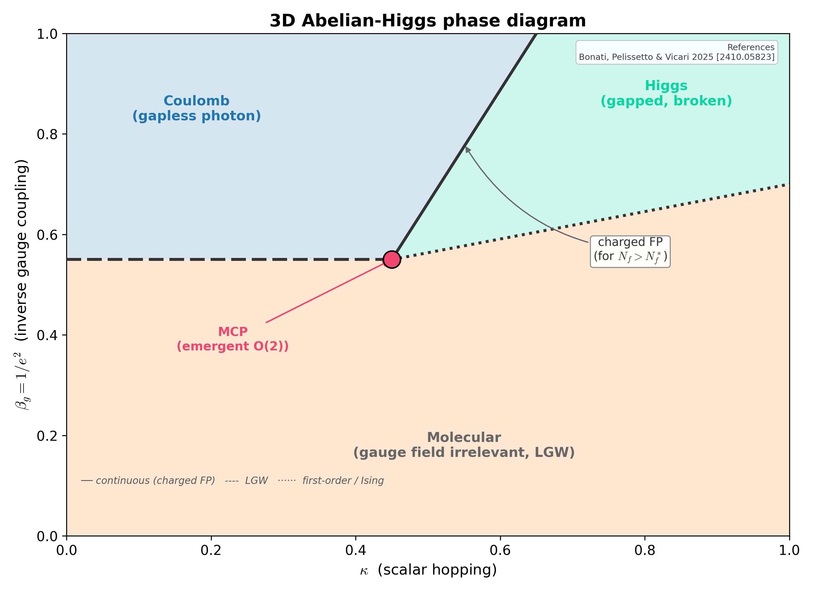

# 3D Abelian-Higgs phase diagram

Schematic of the three phases of the 3D Abelian-Higgs model (Coulomb, Higgs, Molecular) meeting at a multicritical point with emergent O(2) symmetry. The Coulomb-to-Higgs transition is controlled by the *charged fixed point* when `N_f > N_f^*`. Cross-analogue companion of `asymptotic_safety_concept`.

## References

- Bonati, Pelissetto & Vicari (2025), Phys. Rep. [arXiv:2410.05823].
- Lattice AHM with noncompact gauge fields [arXiv:2010.06311].

## See also

- [`docs/cross-analogue-gauge-higgs.md`](../cross-analogue-gauge-higgs.md)
- `asymsafety.transforms.bridge.gauge_higgs.GaugeHiggsAnalogue`
