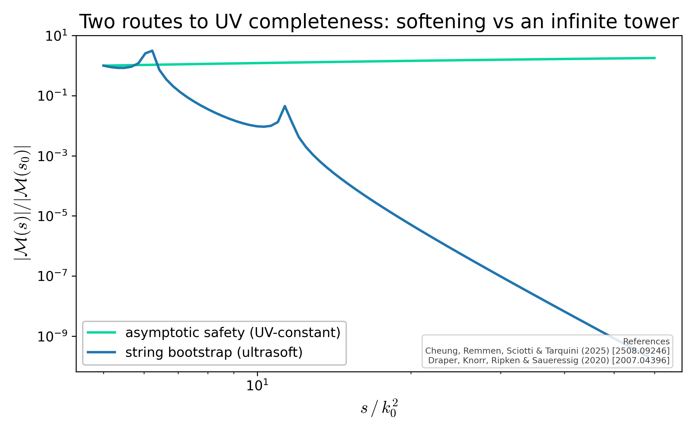

# Two routes to UV completeness

Normalised fixed-angle amplitudes: asymptotic safety reaches a UV-constant amplitude by softening the graviton coupling, while the string bootstrap enforces ultrasoft (super-polynomial) falloff via an infinite higher-spin Regge tower. Both are physically consistent, but distinct.

## References

- Cheung, Remmen, Sciotti & Tarquini (2025) [2508.09246]
- Draper, Knorr, Ripken & Saueressig (2020) [2007.04396]

## See also

- asymsafety.visualization.amplitude_plot.plot_as_vs_string
