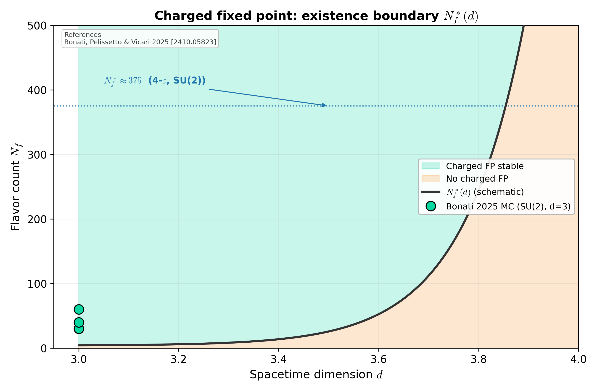

# Charged fixed point: existence boundary

Schematic of `N_f^*(d)`, the matter threshold above which the charged fixed point of 3D gauge-Higgs theory is stable. The 4-ε prediction `N_f^* ≈ 375` (SU(2)) sits far above the lattice value (Bonati et al. 2025 place it well below 30 in d=3). The shaded region is the stable phase; the green points are the published SU(2) MC sample `N_f ∈ {30, 40, 60}`.

## References

- Bonati, Pelissetto & Vicari (2025), Phys. Rep. [arXiv:2410.05823].

## See also

- [`docs/cross-analogue-gauge-higgs.md`](../cross-analogue-gauge-higgs.md)
- `asymsafety.validation.bonati_2025.validate_charged_fp_existence`
