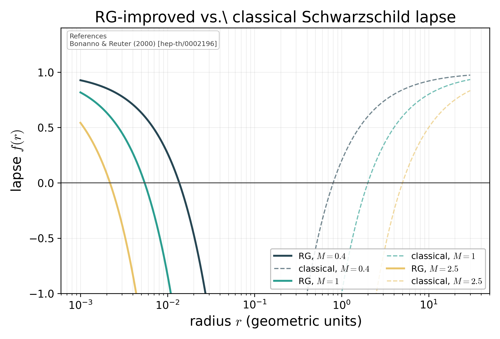

# Classical vs RG-improved lapse for several masses

Overlay of classical Schwarzschild `1 - 2M/r` (dashed) and RG-improved lapse (solid) for three representative masses, illustrating horizon merging at the critical mass and the naked-mass remnant for sub-critical M.

## References

- Bonanno & Reuter (2000) [hep-th/0002196].
- Platania (2023) [2302.04272].

## See in `docs/LITERATURE.md`

- [black-holes-cosmology](../LITERATURE.md#black-holes-cosmology)

## See also

- `asymsafety.cosmology.visualization.plot_classical_vs_rg_lapse`
