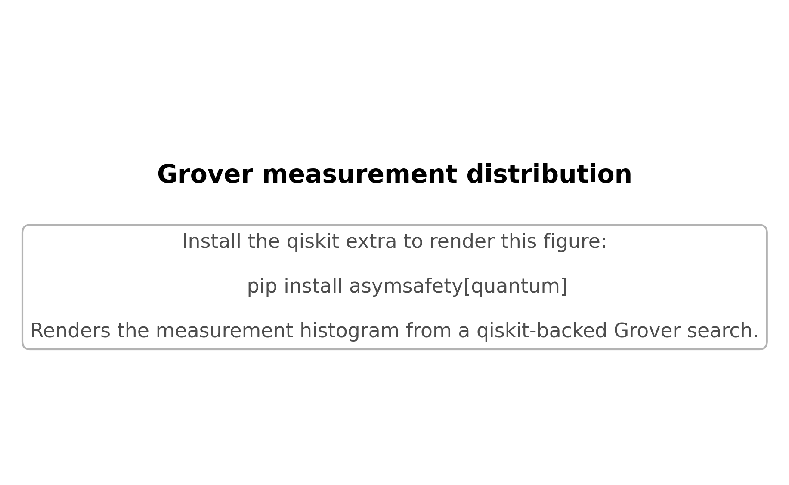

# Grover measurement distribution

Heatmap of measurement counts from an EH Grover run after the optimal number of iterations, with the classically refined NGFP marked by a green star. Concentration on the marked grid points demonstrates the amplitude amplification.

## References

- Grover (1996), [quant-ph/9605043].

## See also

- `asymsafety.quantum.grover.search.GroverFixedPointSearch`
