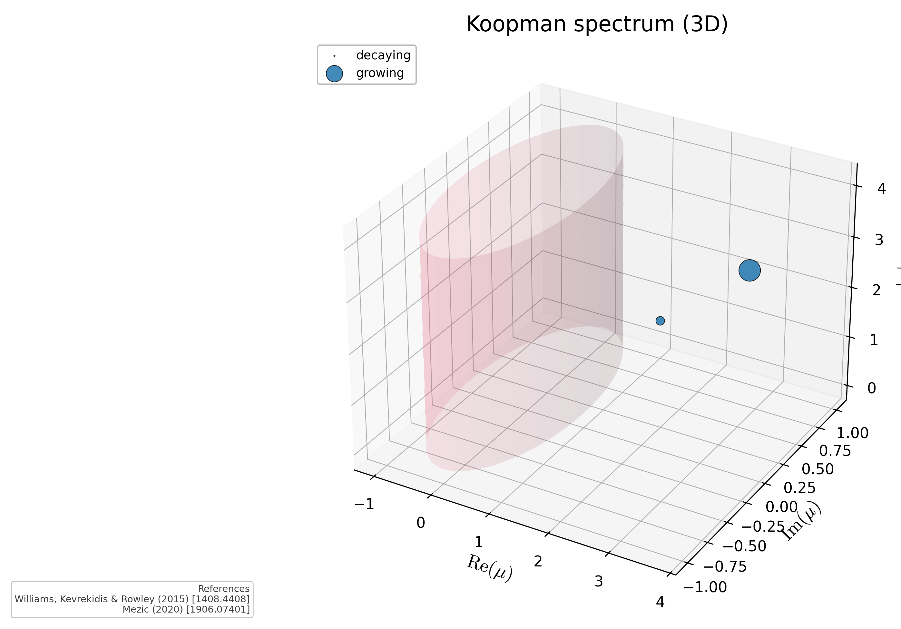

# Koopman spectrum (3D embedding)

3D scatter of Koopman eigenvalues lifted to `(Re mu, Im mu, |mu|)` with the unit cylinder drawn as the stability boundary. Resolves degeneracies hidden by the flat 2D spectrum view.

## References

- Mezic (2020) [1906.07401].

## See also

- `asymsafety.gui.visualization_3d.koopman_spectrum_3d`
