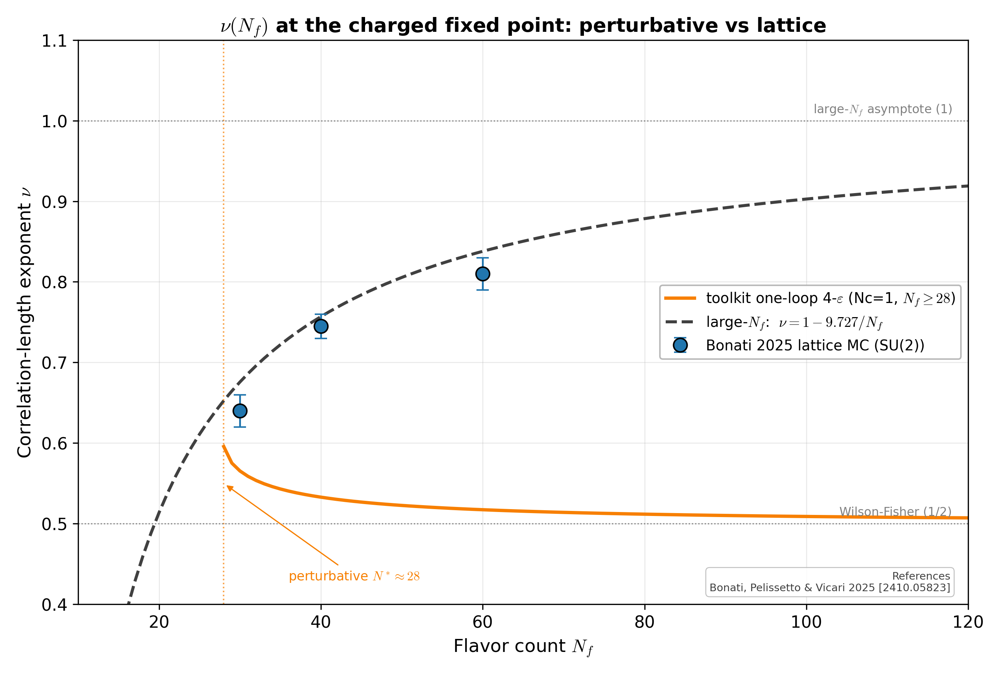

# ν(N_f) at the charged fixed point

Correlation-length exponent at the charged FP of 3D SU(2) + `N_f` gauge-Higgs. Three curves overlaid: the toolkit's one-loop 4-ε prediction (approaches the Wilson-Fisher limit ν → 1/2), the large-`N_f` field-theory asymptote ν = 1 − 9.727/N_f (approaches 1), and Bonati et al.'s lattice MC points at `N_f ∈ {30, 40, 60}` with their published error bars. The two windows on the physics agree qualitatively on FP existence but live in different quantitative regimes — a faithful echo of the regulator/scheme debate around the gravitational NGFP in asymptotic safety.

## References

- Bonati, Pelissetto & Vicari (2025), Phys. Rep. [arXiv:2410.05823].
- Halperin, Lubensky & Ma (1974), Phys. Rev. Lett. 32, 292.

## See also

- [`docs/cross-analogue-gauge-higgs.md`](../cross-analogue-gauge-higgs.md)
- `asymsafety.transforms.bridge.gauge_higgs.correlation_length_exponent`
- `asymsafety.validation.bonati_2025.BONATI_SU2_MC`
