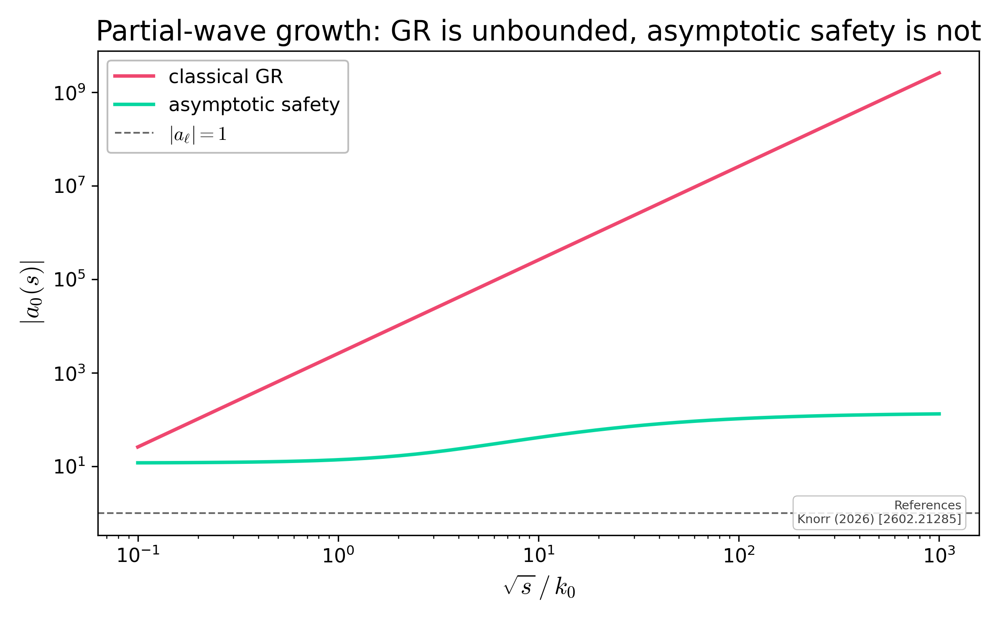

# Partial-wave growth and unitarity

The s-wave partial amplitude |a_0(s)|. Classical gravity runs past the |a_l|=1 unitarity line near the Planck scale; the asymptotically-safe amplitude stays bounded.

## References

- Knorr (2026) [2602.21285]

## See also

- asymsafety.visualization.amplitude_plot.plot_partial_wave_unitarity
