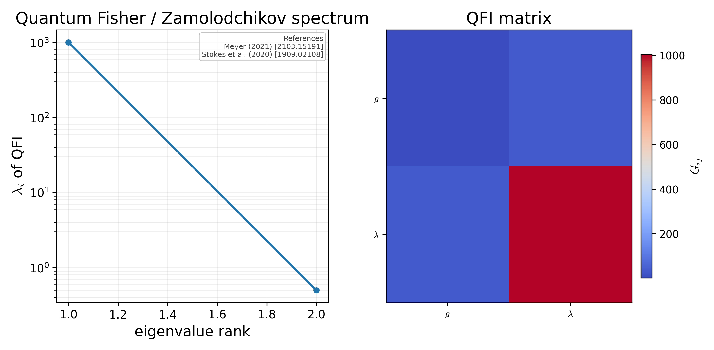

# Quantum Fisher / Zamolodchikov eigenspectrum

Sorted eigenvalues of the QFI matrix (semi-log-y) plus the QFI heatmap. Spread between top and bottom eigenvalues is the Zamolodchikov-metric anisotropy near the NGFP — small eigenvalues indicate flat directions (parameter degeneracies).

## References

- Meyer (2021) [2103.15191].
- Stokes et al. (2020) [1909.02108].

## See also

- `asymsafety.quantum.vqrg.fisher.QuantumFisherInformation`
