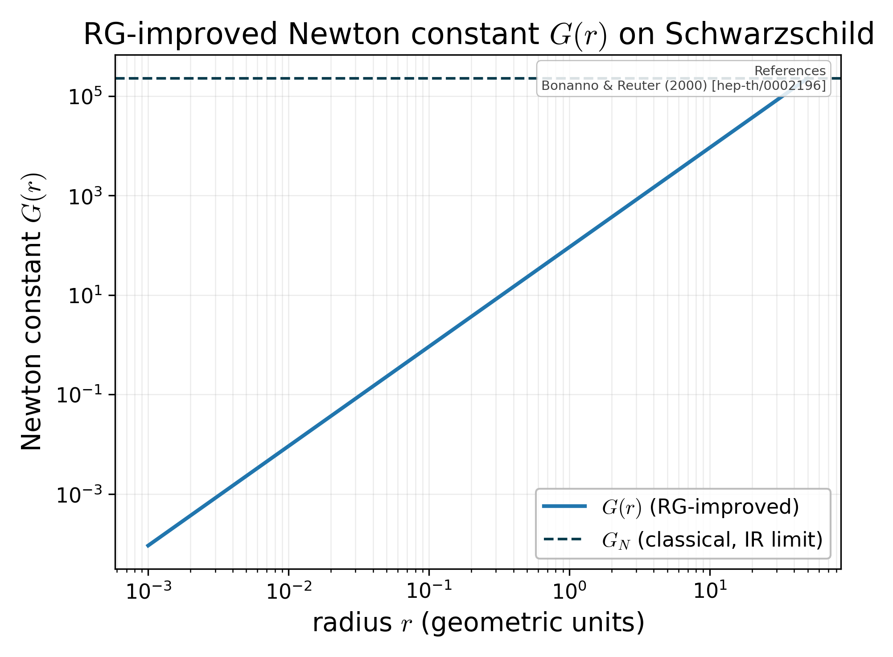

# RG-improved Newton constant on Schwarzschild

Log-log plot of the position-dependent Newton constant `G(r) = g(k(r))/k(r)^2` along an EH trajectory through the Reuter NGFP, with the classical IR value as a dashed reference and the Planck length marked.

## References

- Bonanno & Reuter (2000), Phys. Rev. D 62, 043008 [hep-th/0002196].

## See in `docs/LITERATURE.md`

- [black-holes-cosmology](../LITERATURE.md#black-holes-cosmology)

## See also

- `asymsafety.cosmology.rg_improved_bh.RGImprovedSchwarzschild`
- `asymsafety.cosmology.visualization.plot_running_newton_constant`
