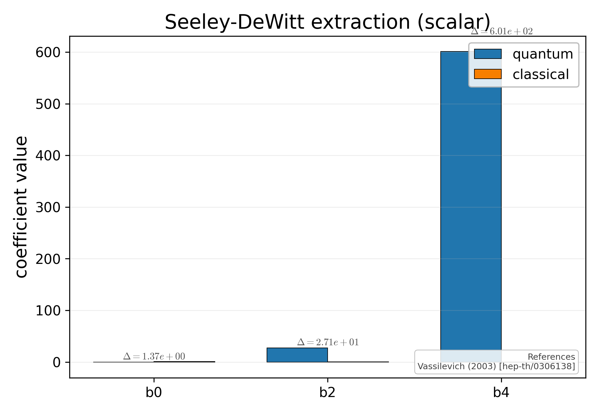

# Seeley-DeWitt coefficients: quantum vs classical

Bar chart comparing quantum-extracted heat-kernel coefficients `b_0, b_2, b_4` (from polynomial fitting of `Z(beta)`) with their classical Vassilevich values. The deviation labels above each pair quantify the truncation error.

## References

- Vassilevich (2003) [hep-th/0306138].

## See also

- `asymsafety.frg.heat_kernel.SeeleyDeWittCoefficients`
