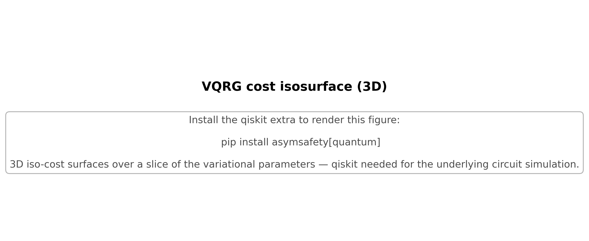

# VQRG cost isosurfaces (3D parameter slice)

Translucent iso-cost surfaces over a 3-parameter slice of the VQRG ansatz. Innermost surface marks the basin of the global minimum; outer surfaces show how the basin grows with cost threshold.

## References

- Cerezo et al. (2021) [2012.09265].

## See also

- `asymsafety.gui.visualization_3d.vqrg_cost_isosurface_3d`
