# Visualization Guide

A one-stop reference for every plotting function in `asymsafety`. Each entry shows the call signature, an embedded sample image generated by `scripts/generate_figures.py`, and a short *when to use* note.

> **Contract.** Every plotting function in this guide accepts an optional `ax=None` argument and returns a `matplotlib.figure.Figure`. They all call [`apply_style()`](../src/asymsafety/visualization/style.py) so styling stays consistent, and they reuse the semantic colour palette: blue = relevant / Litim, orange = irrelevant / Exponential, green star = NGFP, white circle = GFP, red-pink = separatrix. Fixed-point markers and citation footnotes come from `asymsafety.visualization.style.{annotate_fixed_point,add_reference_box,add_legend_panel}`. Regenerate every figure below in one shot with `python scripts/generate_figures.py`.

## Sections

1. [Conceptual diagrams](#1-conceptual-diagrams)
2. [2D phase portraits](#2-2d-phase-portraits)
3. [3D flow](#3-3d-flow)
4. [Hydraulic](#4-hydraulic)
5. [Transforms](#5-transforms)
6. [Quantum](#6-quantum)
7. [Cosmology](#7-cosmology)
8. [Spectral / heat-kernel](#8-spectral--heat-kernel)
9. [Scattering amplitudes](#9-scattering-amplitudes)

---

## 1. Conceptual diagrams

Schematic / pedagogical figures that don't depend on a specific truncation.

### `asymptotic_safety_concept()`
```python
from asymsafety.visualization.conceptual import asymptotic_safety_concept
fig = asymptotic_safety_concept()
```


*When to use*: introduction slides; teaching what an NGFP is. Two panels — theory-space cartoon and `g(k)` running with vs. without an NGFP.

### `wetterich_equation_diagram()`
```python
from asymsafety.visualization.conceptual import wetterich_equation_diagram
fig = wetterich_equation_diagram()
```


*When to use*: explaining what the FRG engine actually computes. Schematic of the one-loop trace with regulator insertion.

### `regulator_comparison()`
```python
from asymsafety.visualization.conceptual import regulator_comparison
fig = regulator_comparison()
```


*When to use*: justifying the choice of Litim vs Exponential regulator. Plots both shape functions on a common axis.

### `fixed_point_stability_concept()`
```python
from asymsafety.visualization.conceptual import fixed_point_stability_concept
fig = fixed_point_stability_concept()
```


*When to use*: explaining what "relevant directions" mean — the linearised flow with eigenvectors and the critical-exponent table.

### `scattering_concept()`
```python
from asymsafety.visualization.conceptual import scattering_concept
fig = scattering_concept()
```
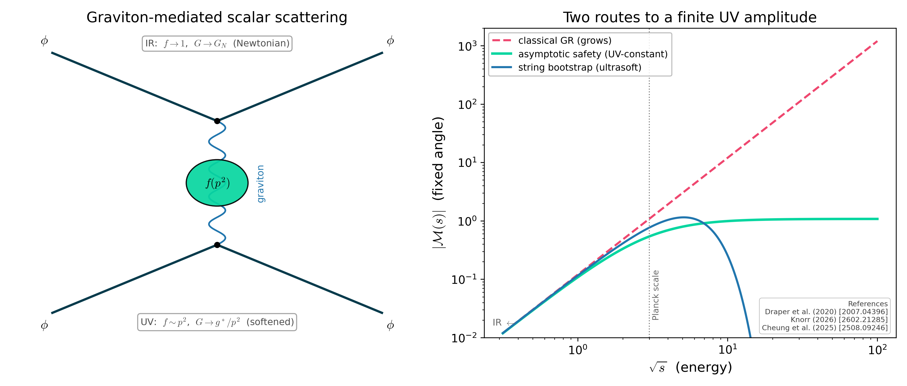

*When to use*: introducing the scattering observable. Two panels — the graviton-exchange diagram with the form-factor blob, and `|M|` vs energy showing GR growth, the asymptotic-safety UV plateau, and the ultrasoft string falloff.

### `scattering_bridge_diagram()`
```python
from asymsafety.visualization.bridge_diagram import scattering_bridge_diagram
fig = scattering_bridge_diagram()
```
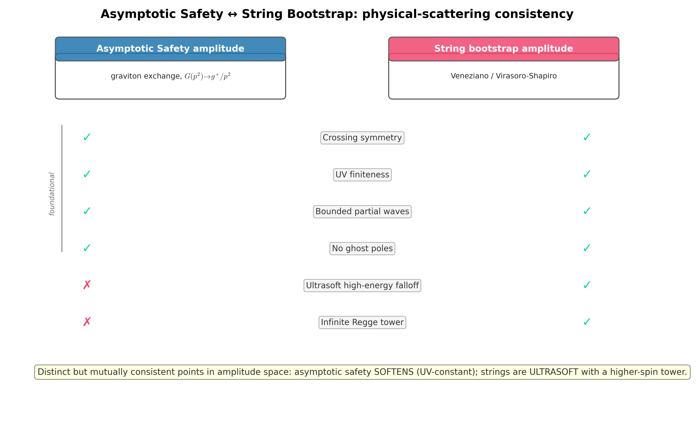

*When to use*: the AS-vs-string consistency comparison. A two-column table of physical-scattering criteria with ✓/✗ per column — both satisfy the foundational ones; only strings are ultrasoft with a Regge tower.

---

## 2. 2D phase portraits

Streamplots over coupling-coupling planes, plus running-couplings line plots and continuation panels.

### `phase_portrait_2d(system, x, y, *, fixed_points=None, ...)`
Generic streamplot for any beta system on any 2-coupling slice. `phase_portrait_2d(eh_system, "g", "lambda", fixed_points=[ngfp])` is the everyday call.

### `annotated_eh_phase_portrait()`
```python
from asymsafety.visualization.phase_portrait import annotated_eh_phase_portrait
fig = annotated_eh_phase_portrait()
```


*When to use*: the publication-grade EH figure — back-integrated separatrix, eigenvector arrows labelled with `theta_i`, propagator-pole at `lambda = 1/2`, citation box. Drop into a paper as-is.

### `flow_diagram(trajectories, ...)`
```python
from asymsafety.analysis.flow import FlowIntegrator
from asymsafety.visualization.phase_portrait import flow_diagram

trajs = [FlowIntegrator(system).integrate(ic, t_span=(-8, 8)) for ic in init_conditions]
fig = flow_diagram(trajs)
```


*When to use*: the textbook running-couplings view — `g(t)` and `lambda(t)` for several initial conditions on a shared time axis.

### `separatrix_overlay(system, fixed_point, ax=None)`
Adds a back-integrated UV-critical separatrix to an existing 2D plot. Useful alongside `phase_portrait_2d` to highlight the basin boundary.

### `regulator_comparison_panels(system_litim, system_exponential, ...)`
Side-by-side phase portraits under the two regulator choices, with NGFP-drift annotation. Good for scheme-dependence audits.

### `quadratic_pairwise_grid(system, n_grid=...)`
```python
from asymsafety.visualization.phase_portrait import quadratic_pairwise_grid
fig = quadratic_pairwise_grid(quadratic_system, n_grid=18)
```


*When to use*: quadratic gravity has 4 couplings; this is the 2x3 panel that shows every pairwise projection at once.

### `plot_critical_exponents(continuation_result)` and friends
```python
from asymsafety.analysis.continuation import continuation
from asymsafety.visualization.fixed_point_plot import (
    plot_critical_exponents, plot_fixed_point_locations, plot_matter_content_continuation,
)
fig = plot_matter_content_continuation(matter_continuation_result)
```


*When to use*: tracking a fixed point as you sweep an external parameter (matter content, dimension, ...). `plot_matter_content_continuation` overlays the Korver (2024) bound shading.

---

## 3. 3D flow

`mplot3d` views; all support mouse rotation in interactive backends.

### `flow_trajectories_3d(trajs, x, y, z_coupling=None, ...)`
```python
from asymsafety.gui.visualization_3d import flow_trajectories_3d
fig = flow_trajectories_3d(trajs, "g", "lambda", z_coupling=None,
                            fixed_points=[ngfp], show_eigenvectors=True)
```


*When to use*: world-line view — pass `z_coupling=None` to get `(g, lambda, t)`. Pass an explicit third coupling to project onto a 3-coupling slice.

### `phase_portrait_3d(system, x, y, z_coupling, ...)`
3D quiver plot of the beta-vector field. Best for foliated and quadratic truncations where the natural state space is genuinely three-dimensional.

### `fixed_point_stability_3d(fp, sa, x, y, z, ...)`
```python
from asymsafety.gui.visualization_3d import fixed_point_stability_3d
fig = fixed_point_stability_3d(fp, sa, "g", "lambda", "lambda_ADM",
                                scale=0.35, show_theta_labels=True)
```


*When to use*: zoom on a single NGFP with the eigenvector arrows colour-coded by relevance, dashed arcs for spirals, theta-labels on each tip.

### `foliated_phase_portrait_3d(system, ...)`
```python
from asymsafety.gui.visualization_3d import foliated_phase_portrait_3d
fig = foliated_phase_portrait_3d(foliated_system, n_grid=5, fixed_points=fps)
```


*When to use*: foliated EH `(g, lambda, lambda_ADM)` with the `lambda_ADM = 1` plane highlighted (the full-Diff restoration locus).

### `flow_basin_3d(system, fp, ...)`
```python
from asymsafety.gui.visualization_3d import flow_basin_3d
fig = flow_basin_3d(eh_system, ngfp, n_samples=40, radius=0.15, t_span=(0, 2.5))
```


*When to use*: Monte-Carlo basin-of-attraction visualisation — captured (blue) vs escaped (orange) trajectories from a sphere around the NGFP.

### `koopman_spectrum_3d(edmd_result)`
3D scatter of Koopman eigenvalues lifted to `(Re mu, Im mu, |mu|)`, with the unit cylinder as the stability boundary. Use when many eigenvalues collapse on top of one another in the 2D view.

### `vqrg_cost_isosurface_3d(cost, base_params, dims, ...)`
3D iso-cost surfaces over a 3-parameter slice of the variational ansatz. The innermost surface marks the basin around the global minimum.

### `quadratic_stability_3d(fp, sa, ...)`
Convenience wrapper over `fixed_point_stability_3d` with sensible defaults for the quadratic-gravity 4-coupling space.

---

## 4. Hydraulic

### `plot_hydraulic_network(network, pressures=None, ...)`
```python
from asymsafety.hydraulic.mapping import RGToHydraulicMapper
from asymsafety.hydraulic.visualization import plot_hydraulic_network
network = RGToHydraulicMapper(eh_system).build_network(reference_point={"g": 0.7, "lambda": 0.14})
fig = plot_hydraulic_network(network)
```


*When to use*: visualise the auto-generated hydraulic analogue of an RG flow. Node colour = pressure (= coupling value at the reference point); pipe width = pipe diameter.

### `cross_analogue_bridge_diagram()` and `hydraulic_analogy_diagram()`
Schematic mapping diagrams for the cross-analogue bridge.
```python
from asymsafety.visualization.bridge_diagram import (
    cross_analogue_bridge_diagram, hydraulic_analogy_diagram,
)
fig = cross_analogue_bridge_diagram()
```
 

---

## 5. Transforms

Cross-domain plots that visualise the same RG flow through Laplace / wavelet / resolvent / commutative-bridge lenses.

### `plot_bode(bode_data, entry=(0,0), ...)`
```python
from asymsafety.transforms.bridge.impedance import ImpedanceBridge
from asymsafety.transforms.visualization.transform_plots import plot_bode
bode = ImpedanceBridge(stability.stability_matrix).bode_data(omega_range=(0.01, 100), n_points=200)
fig = plot_bode(bode, entry=(0, 0))
```


*When to use*: control-theory view of the linearised RG flow. Magnitude / phase along the imaginary frequency axis; resonances flag the locations of critical exponents.

### `plot_scalogram(wavelet_result, coupling_index=0, *, coupling_name=None, ...)`
```python
from asymsafety.transforms.integral.wavelet import RGFlowWavelet
from asymsafety.transforms.visualization.transform_plots import plot_scalogram
wavelet = RGFlowWavelet(traj).transform(np.geomspace(0.05, 5, 32))
fig = plot_scalogram(wavelet, coupling_index=0, coupling_name="g")
```


*When to use*: time-scale localisation of the running coupling. Bright bands at small scales mark crossover regimes; large-scale fade indicates the asymptotic plateau.

### `plot_pseudospectrum(resolvent_op, epsilon_values, ...)`
```python
from asymsafety.transforms.linear.resolvent import ResolventOperator
from asymsafety.transforms.visualization.transform_plots import plot_pseudospectrum
fig = plot_pseudospectrum(ResolventOperator(stab), epsilon_values=[1.0, 0.1, 0.01])
```


*When to use*: robustness audit of `theta_i`. Thin contours = robust eigenvalues; broad contours = non-normal sensitivity that small truncation/regulator changes amplify.

### `plot_comparison_table(table, *, include_hydraulic=False, ...)`
```python
from asymsafety.transforms.bridge.cross_analogue import CrossAnalogueBridge
from asymsafety.transforms.visualization.transform_plots import plot_comparison_table
table = CrossAnalogueBridge(system, fp, sa).full_comparison_table()
fig = plot_comparison_table(table)
# fig = plot_comparison_table(table, include_hydraulic=True)  # optional sanity check
```


*When to use*: side-by-side bars of `Re(theta_i)` from the three perturbative paths through the bridge (direct RG stability, transfer-matrix exponentiation, resolvent poles). These three agree at the NGFP within numerical tolerance. The hydraulic path is excluded by default because it returns impedance eigenvalues of the generated pipe network rather than the RG critical exponents themselves (different dimensionality and order of magnitude); pass `include_hydraulic=True` to add it as an overlay.

---

## 6. Quantum

Plots over the four quantum sub-domains. Functions whose backend depends on qiskit raise `ImportError` at call-time only — the import of the visualization module itself does *not* require qiskit.

### Koopman

```python
from asymsafety.quantum.koopman.operator import KoopmanOperator
from asymsafety.quantum.visualization import (
    plot_koopman_spectrum, plot_koopman_modes, plot_qft_power_spectrum,
)
edmd = KoopmanOperator(system).compute_edmd(trajs, dictionary_degree=4)
fig = plot_koopman_spectrum(edmd)
fig = plot_koopman_modes(edmd, system.coupling_names, top_k=8)
```
 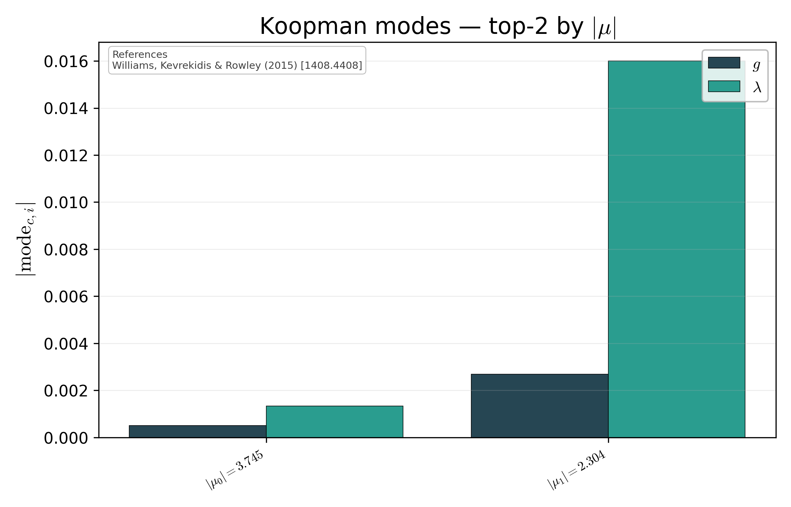

*When to use*: Koopman spectrum + modes diagnose which observables grow / decay under the lifted flow. `plot_qft_power_spectrum` (qiskit-only) gives the QFT amplitude spectrum of a single coupling.

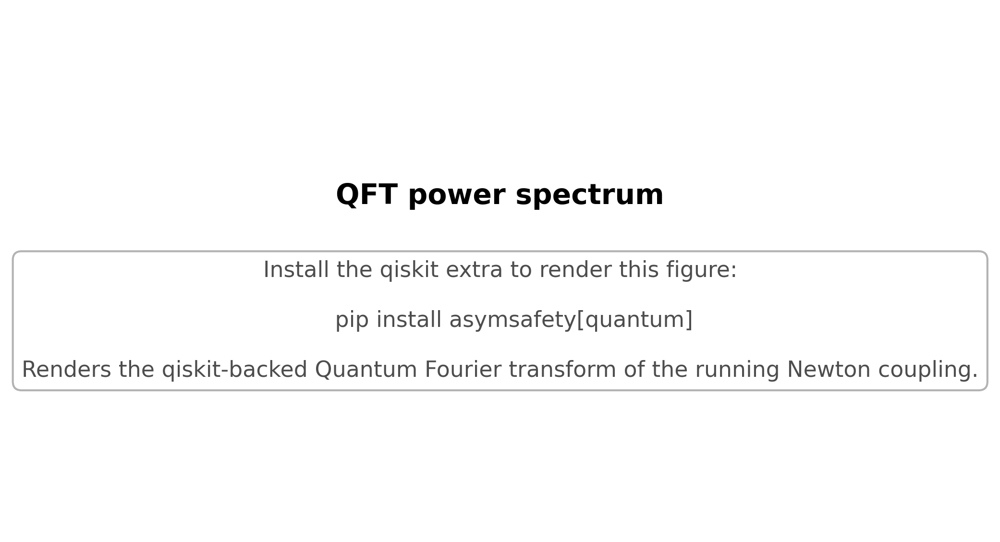

### Grover

```python
from asymsafety.quantum.grover.encoding import CouplingGridEncoding
from asymsafety.quantum.grover.oracle import BetaOracle
from asymsafety.quantum.grover.search import GroverFixedPointSearch
from asymsafety.quantum.visualization import (
    plot_grover_success_probability, plot_grover_measurement_distribution,
)
encoding = CouplingGridEncoding({"g": (0.1, 1.4), "lambda": (-0.2, 0.4)}, n_bits=4)
oracle = BetaOracle(system, encoding, epsilon=0.5)
search = GroverFixedPointSearch(system, encoding, oracle)
fig = plot_grover_success_probability(search, n_iter_max=20)
```
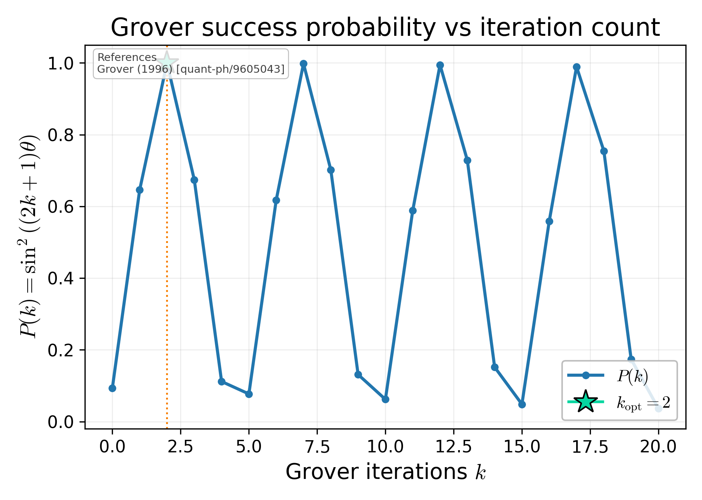 

*When to use*: success-probability curve to see the sqrt(N) speedup. Measurement-distribution heatmap (qiskit-only) shows the amplitude amplification working.

### VQRG

```python
from asymsafety.quantum.visualization import (
    plot_vqrg_cost_landscape, plot_vqrg_optimization_trajectory, plot_quantum_fisher_eigenvalues,
)
fig = plot_vqrg_cost_landscape(cost, base_params, dims=(0, 1), n_grid=24)
```


```python
fig = plot_vqrg_optimization_trajectory(history, parameters_history=traj)
```
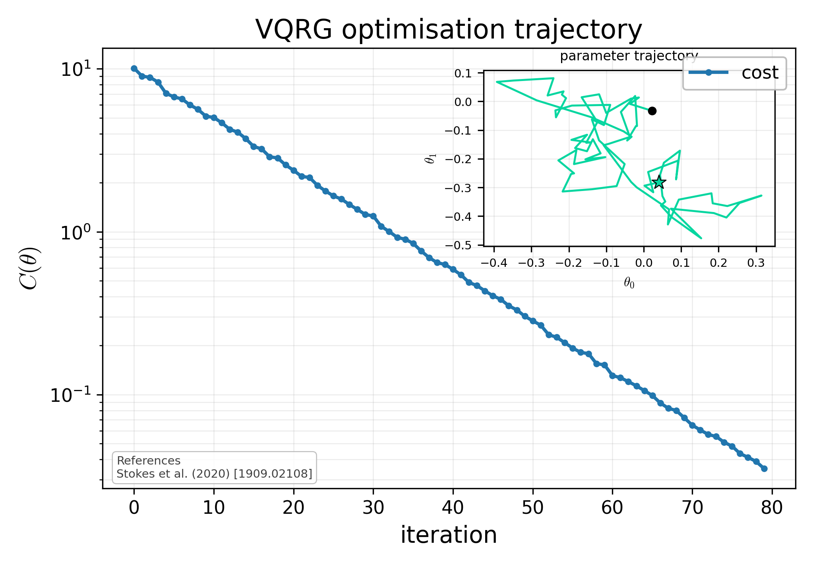

```python
fig = plot_quantum_fisher_eigenvalues(qfi_matrix)
```


*When to use*: cost landscape (qiskit-only) for picking ansatz starting points; trajectory for convergence diagnostics; Fisher eigenvalues for Zamolodchikov-metric anisotropy.

### Thermal

```python
from asymsafety.quantum.thermal.partition import PartitionFunctionEstimator
from asymsafety.quantum.visualization import (
    plot_partition_function, plot_seeley_dewitt_extraction, plot_gibbs_state_purity,
)
fig = plot_partition_function(estimator, beta_range=(0.01, 2.0))
fig = plot_seeley_dewitt_extraction(estimator, sdw=sdw_classical)
fig = plot_gibbs_state_purity(gibbs)
```
  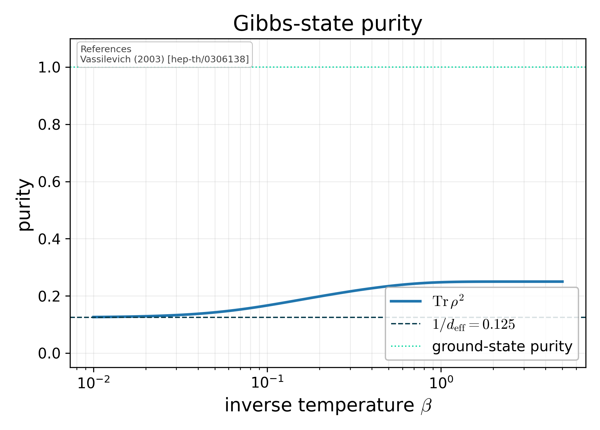

*When to use*: heat-kernel-based extraction of Seeley-DeWitt coefficients; thermal benchmarks of the Laplacian Hamiltonian.

---

## 7. Cosmology

RG-improved geometry plots driven by `RGImprovedSchwarzschild` and `RGImprovedFLRW`.

```python
from asymsafety.cosmology.rg_improved_bh import RGImprovedSchwarzschild
from asymsafety.cosmology.rg_improved_flrw import RGImprovedFLRW
from asymsafety.cosmology.visualization import (
    plot_running_newton_constant, plot_lapse_with_horizons,
    plot_classical_vs_rg_lapse, plot_hawking_temperature,
    plot_scale_identification, plot_flrw_evolution,
)

bh = RGImprovedSchwarzschild(trajectory=traj, M=2.0)
fig = plot_running_newton_constant(bh)
fig = plot_lapse_with_horizons(bh)
fig = plot_classical_vs_rg_lapse(bh, M_values=(0.4, 1.0, 2.5))
fig = plot_hawking_temperature(bh, M_range=(0.3, 4.0))
fig = plot_flrw_evolution(RGImprovedFLRW(trajectory=traj))
```
    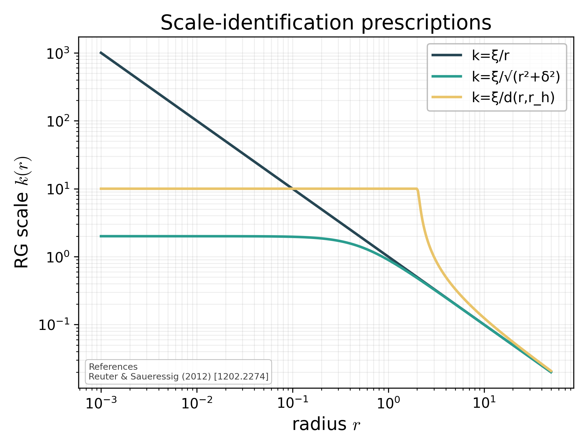 

*When to use*:
- `plot_running_newton_constant` — see `G(r)` vs the classical reference.
- `plot_lapse_with_horizons` — show the de Sitter core (`f → 1` at `r → 0`) and locate the event horizon `r_+` (also the Cauchy horizon `r_-` for super-critical mass, when both exist). The default `r_range=(1e-3, 5)` and `y_clip=(-2, 1.3)` restrict to the regime where the trajectory-based `G(r)` is physical.
- `plot_classical_vs_rg_lapse` — visualise the critical-mass remnant.
- `plot_hawking_temperature` — RG-improved `T_H` vs the classical `1/(8πM)` asymptote. The surface-gravity sign is taken in absolute value to recover physical (positive) `T_H` regardless of how the central-difference of the trajectory-based lapse falls.
- `plot_scale_identification` — pick a `k(r)` prescription with eyes open about how each regularises the origin.
- `plot_flrw_evolution` — three-panel FLRW summary `(a(t), H(t), G(t)/Λ(t))`.

**Note**: the cosmology figures use a trajectory of the pure-EH β-functions integrated from a small perturbation off the NGFP backward in RG time. The toolkit's EH system has a non-trivial IR fixed point at roughly `(g, λ) = (0.058, 0.343)` rather than running cleanly to the Gaussian FP, so the dimensional Newton constant `G(r) = g(k)/k²` grows in the deep IR and the asymptotic-classical Schwarzschild regime cannot be shown without restricting the plot's r-range. The shipped figures show the de-Sitter core and the horizon structure faithfully.

---

## 8. Spectral / heat-kernel

```python
from asymsafety.frg.spectral import SpectralSumEvaluator
from asymsafety.frg.heat_kernel import SeeleyDeWittCoefficients
from asymsafety.visualization.phase_portrait import (
    plot_spectral_sum_convergence, plot_heat_kernel_coefficients, plot_beta_norm_grid,
)

ss = SpectralSumEvaluator(d=4, l_max=512)
fig = plot_spectral_sum_convergence(ss, n_max_values=[2, 4, 8, 16, 32, 64, 128, 256, 512])

sdw = SeeleyDeWittCoefficients(d=4, R_bar=1.0)
fig = plot_heat_kernel_coefficients(sdw, field_types=("scalar", "vector", "TT"))
```
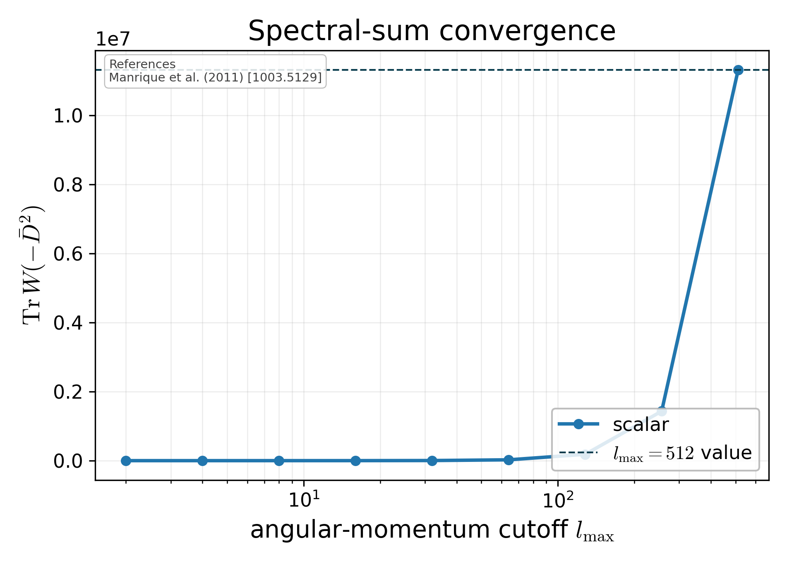 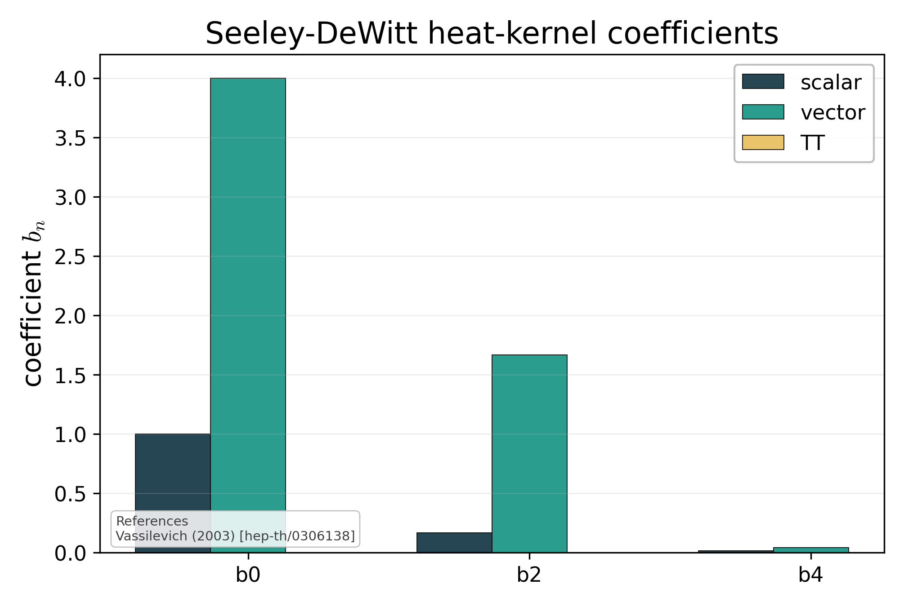

*When to use*:
- `plot_spectral_sum_convergence` — pick a defensible `l_max` for spectral-sum truncations.
- `plot_heat_kernel_coefficients` — quick sanity check on per-field-type Seeley-DeWitt expansions.
- `plot_beta_norm_grid(arrays)` — heatmap of `|beta|` from an `asymsafety eval` `.npz` payload (used by notebook 05).

---

## 9. Scattering amplitudes

Graviton-mediated scattering observables (physics + API in [`scattering-amplitudes.md`](scattering-amplitudes.md)). All live in `asymsafety.visualization.amplitude_plot` and take objects built in `asymsafety.scattering`; the conceptual schematics `scattering_concept()` / `scattering_bridge_diagram()` are in [section 1](#1-conceptual-diagrams).

### `plot_amplitude_vs_energy(amplitude, *, cos_theta=0.3, s_range=(1e-2, 1e8, 200))`
```python
from asymsafety.visualization.amplitude_plot import plot_amplitude_vs_energy
fig = plot_amplitude_vs_energy(amp)   # amp: GravitonMediatedAmplitude
```
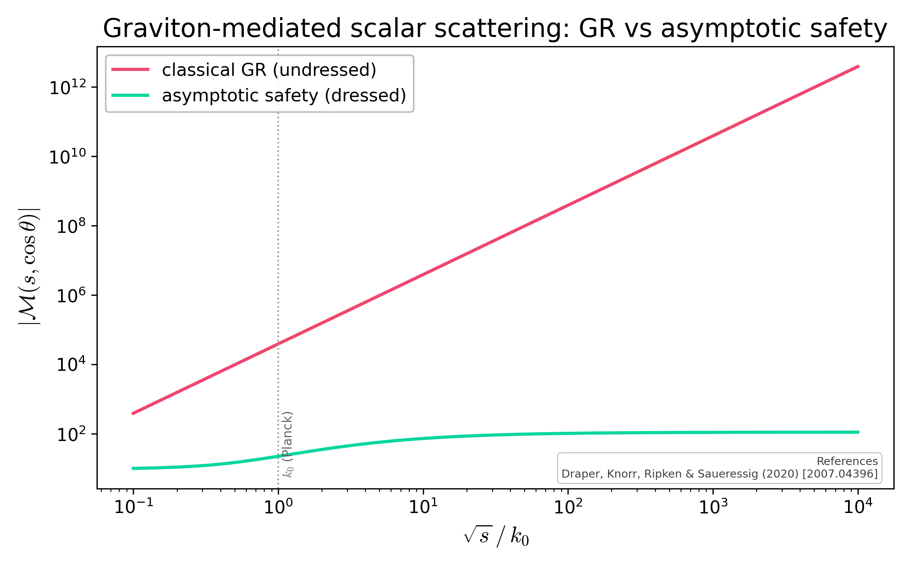

*When to use*: the headline result — classical GR grows with energy while the asymptotically-safe amplitude approaches a finite UV constant.

### `plot_partial_wave_unitarity(amplitude, *, ell=0, s_range=...)`
```python
from asymsafety.visualization.amplitude_plot import plot_partial_wave_unitarity
fig = plot_partial_wave_unitarity(amp)
```


*When to use*: showing that classical gravity's `|a_0(s)|` runs past the `|a_l|=1` unitarity line near the Planck scale while asymptotic safety stays bounded.

### `plot_form_factor(form_factor, *, p2_range=...)`
```python
from asymsafety.visualization.amplitude_plot import plot_form_factor
fig = plot_form_factor(ff)            # ff: GravitonFormFactor
```
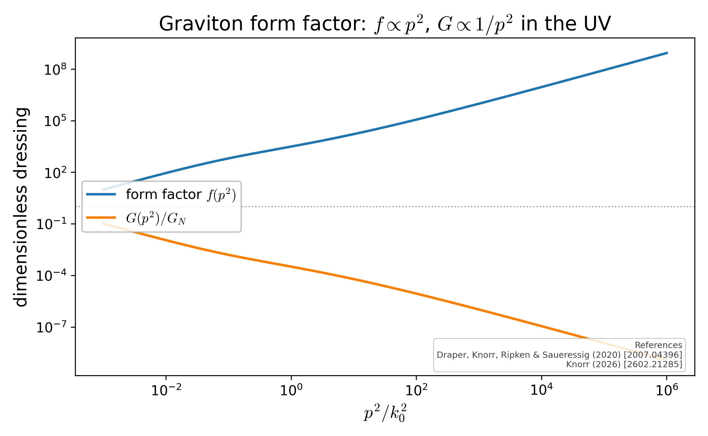

*When to use*: the dressing itself — `f(p^2)` (IR `-> 1`, UV `~ p^2`) and the softening `G(p^2)/G_N`.

### `plot_regge_trajectory(*, alpha0=1.0, alphap=1.0, n_max=5)`
```python
from asymsafety.visualization.amplitude_plot import plot_regge_trajectory
fig = plot_regge_trajectory()
```
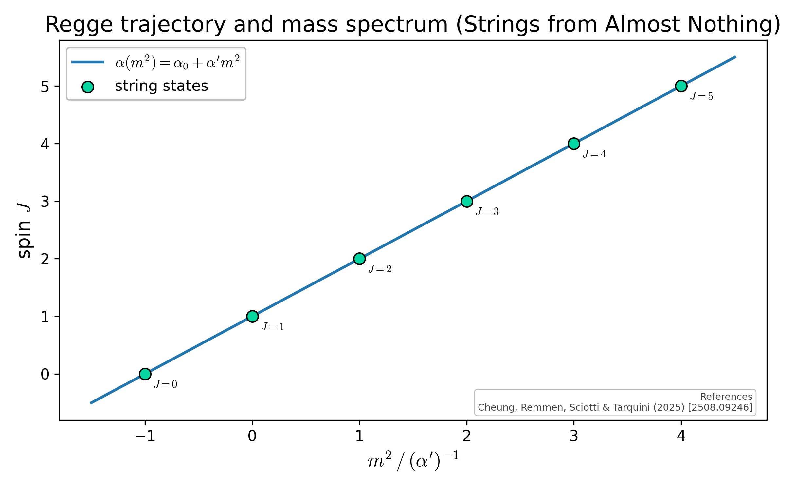

*When to use*: the string-bootstrap side — a Chew–Frautschi plot of the linear Regge trajectory and the mass tower `m_n^2=(n-alpha0)/alpha'`.

### `plot_as_vs_string(bridge, *, cos_theta=0.3, s_range=...)`
```python
from asymsafety.visualization.amplitude_plot import plot_as_vs_string
fig = plot_as_vs_string(bridge)       # bridge: ScatteringBridge
```


*When to use*: the comparison — normalised fixed-angle amplitudes contrasting asymptotic safety (UV-constant via softening) with the ultrasoft string amplitude.

---

## Style helpers

All plots above call into `asymsafety.visualization.style`. The exposed helpers worth knowing:

| Helper | Purpose |
|---|---|
| `apply_style()` | Apply the package-wide rcParams (fonts, dpi, line widths). |
| `coupling_label("g")` → `"$g$"` | LaTeX coupling labels with sensible fallbacks. |
| `annotate_fixed_point(ax, fp, x, y)` | Marker + coordinate-box annotation at an FP. |
| `add_colorbar(fig, ax, mappable, label=...)` | Consistently-styled colourbar. |
| `add_reference_box(ax, refs, loc=...)` | Inline citation footer (BibTeX-style strings). |
| `add_legend_panel(ax, entries, ...)` | Proxy-artist legend builder for 3D axes. |
| `format_arxiv("Reuter (1998)", "hep-th/9605030")` | "Author (Year) [arXiv]" formatting. |
| `theta_label(1.94+3.15j)` | Critical-exponent label with conjugate-pair handling. |

## Regenerating every figure

```bash
# Parallel (default workers = min(8, ncpu)); writes docs/images/<name>.png
python scripts/generate_figures.py

# Subset
python scripts/generate_figures.py --only eh_phase_portrait --only running_couplings

# Refresh sha256 baselines (after intentional rendering changes)
python scripts/generate_figures.py --update-baselines

# Test that figures still match baselines (skips when ASYMSAFETY_ALLOW_RERENDER=1)
pytest tests/test_visualization_regression.py
```

The full smoke-test suite is `pytest tests/test_visualization_smoke.py` — every entry above has a corresponding smoke test that asserts the figure renders cleanly.
